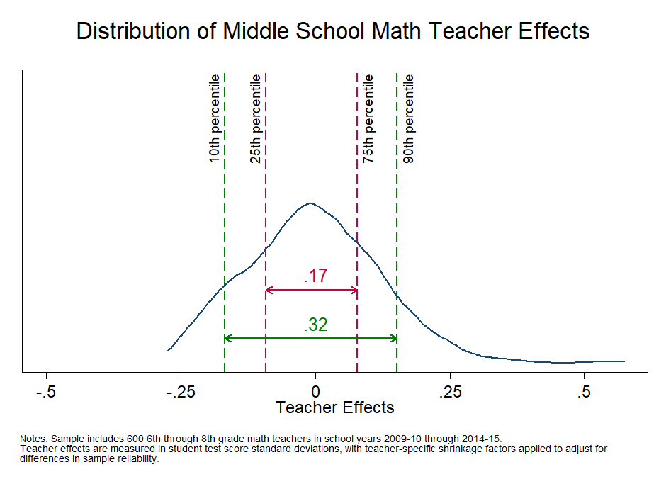

<div class="navbar navbar-default navbar-fixed-top" id="logo">
<div class="container">

</div>
</div>

[OpenSDP Analysis](http://opensdp.github.io/analysis) / [Human Capital Analysis: Evaluation](Human_Capital_Analysis_Evaluation.html) / Examine the Distribution of Teacher Effects




###Preparation
####Purpose

Examine the distribution of teacher effectiveness estimates. 

####Required analysis file variables

 - `tid`
 - `school_year`
 - `school_lvl`
 - `tre_m`


####Analysis-specific sample restrictions

 - Keep only records for teachers with effectiveness estimates in the given subject. 
 - If school_level restriction is chosen, keep only records for elementary or middle school teachers. 
 
 
####Ask yourself
 
- What measures of teacher effectiveness does your agency currently use? Compared to a measure that has little variation, what are the advantages of a measure of teacher effectiveness that has a lot of variation when making decisions about professional development, promotions to teacher leadership, and retention? 
 - What dimensions of teacher effectiveness do value-added estimates measure? What else is important to know about teacher quality? How are other dimensions of teacher quality measured in your agency? 
 - In what ways can knowledge of a teacher's value-added score be used to guide improvement? What kind of training would administrators and teachers need to be able to use the data to improve student achievement? 
 
####Potential further analyses

If more than one measure of teacher effectiveness is recorded in your agency, produce a kdensity graph for each one. Correlate two measures of teacher effectiveness (e.g., value-added estimates and classroom observation ratings). Create a scatterplot with the categories of performance on one axis and value-added ratings on the other. Examine the range of value-added estimates within each performance category. 

###Analysis

####Step 1: Choose the subject and school level. 
Choose the subject (math [m] or ela [e]) and school level (elem or middle) for the analysis. Note: to make multiple charts at the same time, put loops for subject and level around the analysis and graphing code. To include all grade levels in the analysis, comment out the local level command below.


```stata
local subject m
local level middle
```

####Step 2: Load data.


```stata
use "${analysis}/Teacher_Year_Analysis.dta", clear
isid tid school_year
```

####Step 3: Restrict the sample.

Keep years for which teacher effects value added estimates are available. Keep only records for which teachers have pooled teacher effects estimates (pooled estimates use information from all available years for each teacher). If school level restriction is chosen, keep only records from either elementary or middle schools.


```stata
keep if school_year >= 2010 & school_year <= 2015
keep if !missing(current_tre_`subject')
keep if !(sch_high == 1)
if "`level'" == "elem" {	
	keep if sch_elem == 1
}
if "`level'" == "middle" {
	keep if sch_middle == 1
}
```

####Step 4: Review variables.


```stata
tab school_year
bysort tid: gen tag = _n == 1
summ tre_`subject' if tag == 1, detail
drop tag
```


####Step 5: Keep only one record per teacher.

Change data from teacher-year uniqueness level to teacher level by keeping only teacher id and pooled estimate and then dropping duplicate records.


```stata
keep tid tre_`subject'
duplicates drop 
isid tid
```

####Step 6: Get sample size.


```stata
summ tid
local unique_teachers = string(r(N), "%9.0fc")
```

####Step 7: Get and store values for percentiles and percentile differences. 


```stata
sum tre_`subject', detail
local p10_`subject' = r(p10)
local p25_`subject' = r(p25)
local p75_`subject' = r(p75)
local p90_`subject' = r(p90)

local gap90 = round(`p90_`subject'' - `p10_`subject'', .01)
local gap75 = round(`p75_`subject'' - `p25_`subject'', .01)
```

####Step 8: Set positions for text labels, lines, and arrows.


```stata
local gphtxt_10		= `p10_`subject'' - .02
local gphtxt_25		= `p25_`subject'' - .02
local gphtxt_75		= `p75_`subject'' + .02
local gphtxt_90		= `p90_`subject'' + .02

local lnht75		= 1.5
local lnht90		= 0.5
local txtht75		= `lnht75' + .3
local txtht90		= `lnht90' + .3
```

####Step 9: Define subject and school level titles.


```stata
if "`subject'" == "m" {
	local subj_foot "math"
	local subj_title "Math"
}

if "`subject'" == "e" {
	local subj_foot "English/Language Arts"
	local subj_title "ELA"
}
local gradespan "5th through 8th"

if "`level'" == "middle" {
	local subj_title "Middle School `subj_title'"
	local gradespan "6th through 8th"
}

if "`level'" == "elem" {
	local subj_title "Elementary School `subj_title'"
	local gradespan "5th"
}
```

####Step 10: Make chart.


```stata
#delimit ;
twoway (pcarrowi `lnht75' `p25_`subject'' `lnht75' `p75_`subject'',
		color(cranberry) mlwidth(medthin) lwidth(medthin))
	(pcarrowi `lnht75' `p75_`subject'' `lnht75' `p25_`subject'',
		color(cranberry) mlwidth(medthin) lwidth(medthin))
	(pcarrowi `lnht90' `p10_`subject'' `lnht90' `p90_`subject'',
		color(green) mlwidth(medthin) lwidth(medthin))
	(pcarrowi `lnht90' `p90_`subject'' `lnht90' `p10_`subject'',
		color(green) mlwidth(medthin) lwidth(medthin))
	(kdensity tre_`subject', color(navy) area(1) 
		xline(`p25_`subject'', lpattern(dash) lcolor(cranberry))
		xline(`p75_`subject'', lpattern(dash) lcolor(cranberry))
		xline(`p10_`subject'', lpattern(dash) lcolor(green))
		xline(`p90_`subject'', lpattern(dash) lcolor(green))),
		
	title("Distribution of `subj_title' Teacher Effects" " ", span)
	xtitle("Teacher Effects", size(medsmall))
	xscale(range(-.5(.25).5))
	xlabel(-.5(.25).5, labsize(medsmall))
	yscale(range(0(1)6))
	ylabel(none)
	text(5 `gphtxt_10' "10th percentile", orientation(vertical) size(small))
	text(5 `gphtxt_25' "25th percentile", orientation(vertical) size(small))
	text(5 `gphtxt_75' "75th percentile", orientation(vertical) size(small))
	text(5 `gphtxt_90' "90th percentile", orientation(vertical) size(small))
	text(`txtht75' 0 "`gap75'", size(medium) color(cranberry))
	text(`txtht90' 0 "`gap90'", size(medium) color(green))
	legend(off)
	graphregion(color(white) fcolor(white) lcolor(white))
	plotregion(color(white) fcolor(white) lcolor(white) margin(5 5 2 0))
	
	note(" " "Notes: Sample includes `unique_teachers' `gradespan' grade `subj_foot'
teachers in school years 2009-10 through 2014-15." "Teacher effects are measured in
student test score standard deviations, with teacher-specific shrinkage factors applied
to adjust for" "differences in sample reliability.", size(vsmall) span);
#delimit cr	
```

####Step 11: Save chart


```stata
graph save "${graphs}\Overall_Teacher_Effects_`subj_title'.gph" , replace
graph export "${graphs}\Overall_Teacher_Effects_`subj_title'.emf" , replace
```


---

Next Analysis: [Examine the Predictiveness of Teacher Effects](Predictive_Teacher_Effects_Average.html)

