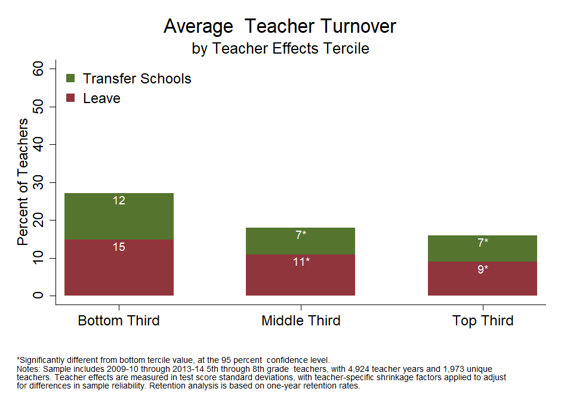
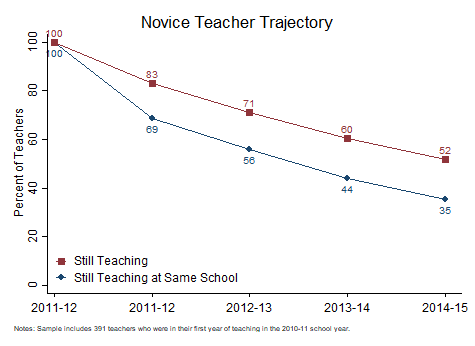

[OpenSDP Home](http://opensdp.github.io)  /  Human Capital Analysis: Retention

# Analyses

##[1. Calculate Average Annual Teacher Retention](Average_Annual_Teacher_Retention.html) {.chart-index-element}

Describes the overall annual shares of teachers who stay in the same school, transfer, and leave teaching in the agency.

##[2. Examine Teacher Turnover Across School Years](Teacher_Turnover_by_School_Year.html) {.chart-index-element}

Describes the shares of teachers who transfer and leave over time.

##[3. Compare Teacher Turnover Rates Across School Poverty Quartiles](Teacher_Turnover_by_School_Poverty_Quartile.html) {.chart-index-element}

Examines the extent to which retention patterns differ according to school poverty characteristics.

##[4. Compare Teacher Turnover Rates Across Teacher Effectiveness Terciles](Teacher_Turnover_by_Teacher_Effectiveness_Tercile.html) {.chart-index-element}

Examines whether the most and least effective teachers are being differentially retained.

##[5. Examine the Retention Trajectory for Novice Teachers](Novice_Teacher_Retention_Trajectory.html) {.chart-index-element}

Describes the retention trajectory of a cohort of novice teachers.

# Getting Started

###Objective

In this guide you will examine teacher retention and turnover patterns, including how turnover varies by school poverty, across school years, and for teachers with different effectiveness estimates. You will also calculate the retention trajectory for novice teachers.

###Using this Guide

The Human Capital Analysis series is a set of guides, code, and sample data about policy-relevant teacher workforce topics. Browse this and other guides in the series for ideas about ways to investigate critical points in teaching careers such as recruitment, placement, development, evaluation, and retention. Each guide includes several analyses in the form of charts together with Stata analysis and graphing code to generate each chart.

Once you've identified analyses that you want to replicate or modify, click the "Download" buttons to download Stata code and sample data. You can make changes to the charts using the code and sample data, or modify the code to work with your own data. If you're familiar with Github you can click "Go to Repository" and clone the entire Human Capital Analysis repository to your own computer.

###About the Data

The data visualizations in the Human Capital Analysis series use a synthetic dataset with four years of data for a fictitious school district. There is one record for each teacher in a given school year. Each record includes data about demographics, credentials, teaching experience, job assignments, evaluation scores, and new hire and retention status, as well as information about the schools to which teachers are assigned. 

###About the Analyses

Schools invest substantial resources recruiting, developing, and retaining high-quality teachers. These analyses reveal how retention patterns vary by school characteristics and by teacher effectiveness categories. Because novice teachers typically experience high rates of turnover, retention analyses often focus on the retention patterns of novice teachers.

###Giving Feedback on the Guide

This guide is an open-source document hosted on Github and generated using the R Statamarkdown package. We welcome feedback, corrections, additions, and updates. Please visit the OpenSDP human capital analysis repository to read our contributor guidelines.