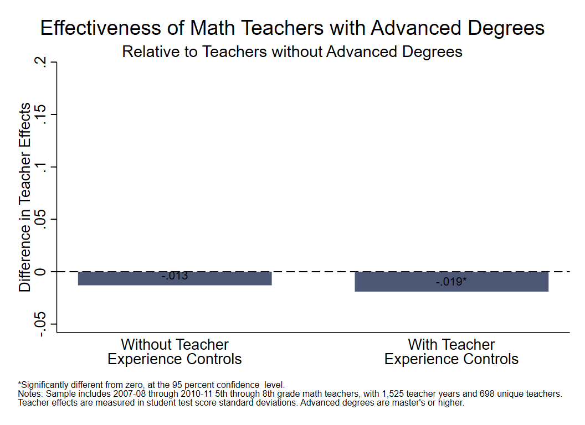

[OpenSDP Analysis](http://opensdp.github.io./analysis)  /  Human Capital Analysis: Development

# Analyses

##[1. Observe Growth in Teacher Effects for Early Career Teachers](Growth_in_Teacher_Effects.html) {.chart-index-element}

Describes the growth in effectiveness for early-career teachers. 

##[2. Examine Teacher Effects by Advanced Degree](Teacher_Effects_Advanced_Degree.html) {.chart-index-element}

Examines the difference in effectiveness for teachers with and without advanced degrees.

# Getting Started

###Objective

Often, teachers are an agency's biggest investment. Once teachers have been recruited and placed in schools, their continued professional development benefits students and improves the success of the agency. Traditionally, agencies have incentivized two major forms of professional development: learning over time from experience and earning a graduate degree. This section of the diagnostic examines ways teachers develop during their careers and identifies whether agency incentives are aligned with gains in teacher effectiveness.  

###Using this Guide

The Human Capital Analysis series is a set of guides, code, and sample data about policy-relevant teacher workforce topics. Browse this and other guides in the series for ideas about ways to investigate critical points in teaching careers such as recruitment, placement, development, evaluation, and retention. Each guide includes several analyses in the form of charts together with Stata analysis and graphing code to generate each chart.

Once you've identified analyses that you want to replicate or modify, click the "Download" buttons to download Stata code and sample data. You can make changes to the charts using the code and sample data, or modify the code to work with your own data. If you're familiar with Github you can click "Go to Repository" and clone the entire Human Capital Analysis repository to your own computer.

###About the Data

The data visualizations in the Human Capital Analysis series use a synthetic dataset with four years of data for a fictitious school district. There is one record for each teacher in a given school year. Each record includes data about demographics, credentials, teaching experience, job assignments, evaluation scores, and new hire and retention status, as well as information about the schools to which teachers are assigned. The recruitment guide also uses a student data file for demographic information.

###About the Analyses

The recruitment process is the first opportunity education agencies have to secure highly effective teachers for their students. This guide documents the kinds of teachers the agency hires (e.g., novices and experienced new hires), their demographic characteristics, and their distribution within the agency. Analyzing recruitment trends can provide direction for a human resource strategy that aims to attract and place highly effective teachers in all classrooms.

###Giving Feedback on the Guide

This guide is an open-source document hosted on Github and generated using the R Statamarkdown package. We welcome feedback, corrections, additions, and updates. Please visit the OpenSDP human capital analysis repository to read our contributor guidelines.
