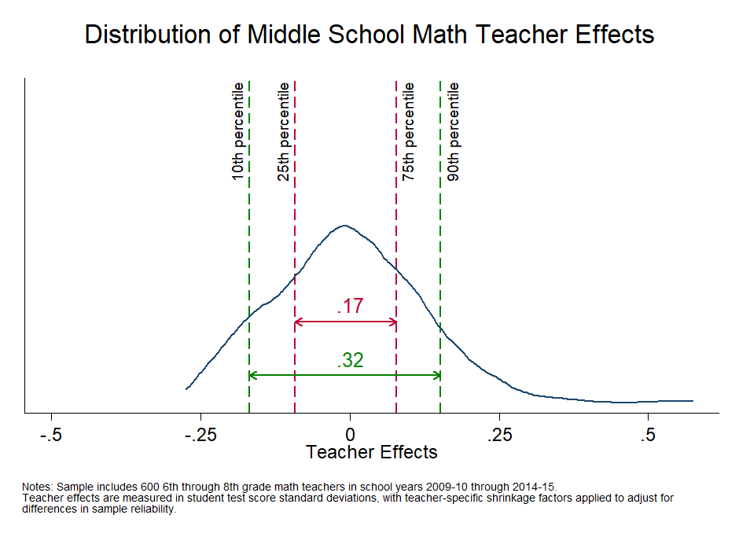
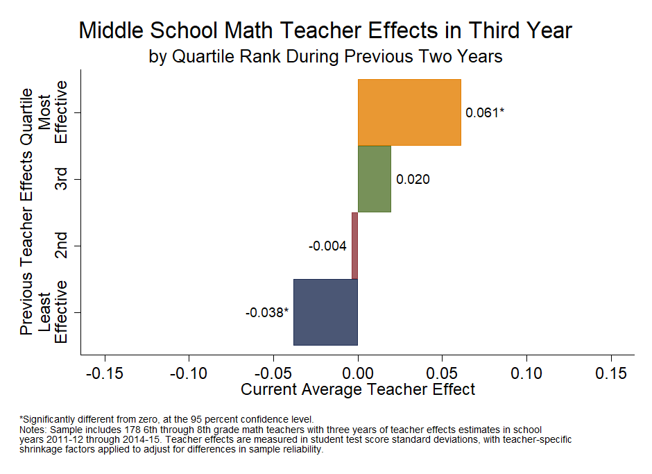
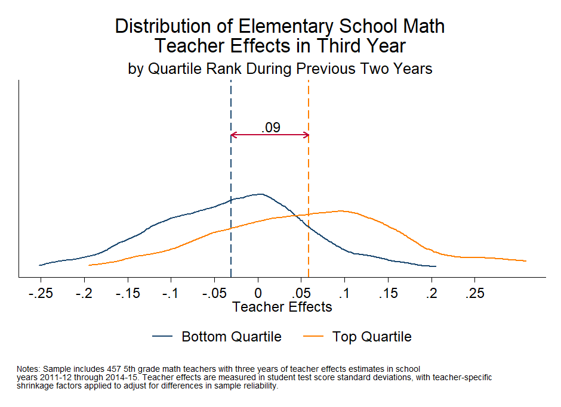

[OpenSDP Analysis](http://opensdp.github.io./analysis)  /  Human Capital Analysis: Recruitment

# Analyses

##[1. Examine the Distribution of Teacher Effects](Distribution_of_Teacher_Effects.html) {.chart-index-element}

Shows the overall distribution of a teacher effectiveness measure.

##[2. Examine the Predictiveness of Teacher Effects](Predictive_Teacher_Effects_Average.html) {.chart-index-element}

Examines whether two years of teacher effectiveness measures are predictive of average teacher effectiveness in a third year. 

##[3. Compare Teacher Effects for Teachers Ranked Most and Least Effective in the Prior Two Years](Predictive_Teacher_Effects_Distribution.html) {.chart-index-element}

Examines the distribution of teacher effects in the third year for teachers in the top and bottom teacher effects quartiles in the previous two years. 

# Getting Started

###Objective

Evaluating teachers serves two purposes: identifying areas where professional development is likely to benefit teachers, and identifying effective and ineffective teachers for career decisions. Evaluations can involve administrator observation, peer observation, collections of classroom preparation materials and artifacts, student surveys, and student achievement data. In the human capital diagnostic, SDP estimates teachers' effectiveness at raising student achievement using value-added methodology to evaluate teacher performance. Your agency may use a difference student growth based measure.  A good measure of teacher effectiveness will have sufficient variation and consistency. That is, teacher effectiveness ratings are spread out across the range of possible values enough to observe differences across groups, and teachers' ratings are fairly well correlated over time. The Evaluation section of the diagnostic examines the extent to which effectiveness estimates meet these criteria.

###Using this Guide

The Human Capital Analysis series is a set of guides, code, and sample data about policy-relevant teacher workforce topics. Browse this and other guides in the series for ideas about ways to investigate critical points in teaching careers such as recruitment, placement, development, evaluation, and retention. Each guide includes several analyses in the form of charts together with Stata analysis and graphing code to generate each chart.

Once you've identified analyses that you want to replicate or modify, click the "Download" buttons to download Stata code and sample data. You can make changes to the charts using the code and sample data, or modify the code to work with your own data. If you're familiar with Github you can click "Go to Repository" and clone the entire Human Capital Analysis repository to your own computer.

###About the Data

The data visualizations in the Human Capital Analysis series use a synthetic dataset with six years of data for a fictitious school district. There is one record for each teacher in a given school year. Each record includes data about demographics, credentials, teaching experience, job assignments, evaluation scores, and new hire and retention status, as well as information about the schools to which teachers are assigned. The recruitment guide also uses a student data file for demographic information.

###About the Analyses

The recruitment process is the first opportunity education agencies have to secure highly effective teachers for their students. This guide documents the kinds of teachers the agency hires (e.g., novices and experienced new hires), their demographic characteristics, and their distribution within the agency. Analyzing recruitment trends can provide direction for a human resource strategy that aims to attract and place highly effective teachers in all classrooms.

###Giving Feedback on the Guide

This guide is an open-source document hosted on Github and generated using the R Statamarkdown package. We welcome feedback, corrections, additions, and updates. Please visit the OpenSDP human capital analysis repository to read our contributor guidelines.
