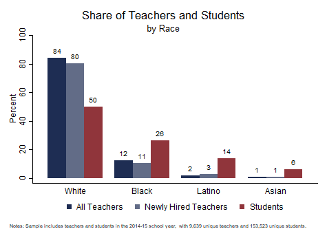

[OpenSDP Home]()  /  Human Capital Analysis: Recruitment

###Objective

Schools invest substantial resources recruiting, developing, and retaining high-quality teachers. These analyses reveal how retention patterns vary by school characteristics and by teacher effectiveness categories. Because novice teachers typically experience high rates of turnover, retention analyses often focus on the retention patterns of novice teachers.

###Using this Guide

The Human Capital Analysis: Retention series is a set of guides, code, and sample data about policy-relevant teacher retention topics. Each guide page includes an analysis in the form of a chart together with the Stata analysis and graphing code to generate the chart.

###About the Data

The data visualizations in this series use a synthetically generated sample data file.

### Contents

##[1. Share of Teachers Who Are New Hires](Share_of_Teachers_Who_Are_New_Hires.html) {.chart-index-element}

Describes the overall shares of novice and experienced new hires.

##[2. Share of Teachers Who Are New Hires by School Year](Share_of_Teachers_Who_Are_New_Hires_by_School_Year.html) {.chart-index-element}

Describes the share of novice and experienced new hires by year.

##[3. Share of Teachers Who Are New Hires by School Poverty Level](Share_of_Teachers_Who_Are_New_Hires_by_School_Poverty_Level.html) {.chart-index-element}

Examines the extent to which new hires are distributed unevenly across the agency according to school poverty characteristics.

##[4. Share of Teachers and Students by Race](Share_of_Teachers_and_Students_by_Race.html) {.chart-index-element}

Compares the shares of all teachers, newly hired teachers, and students by race.
