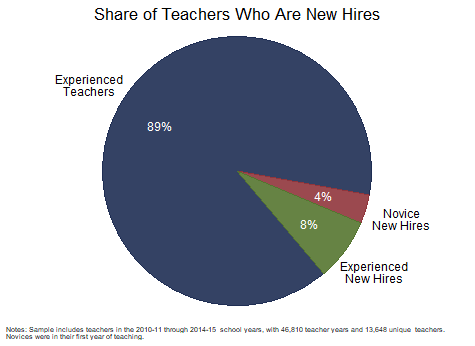
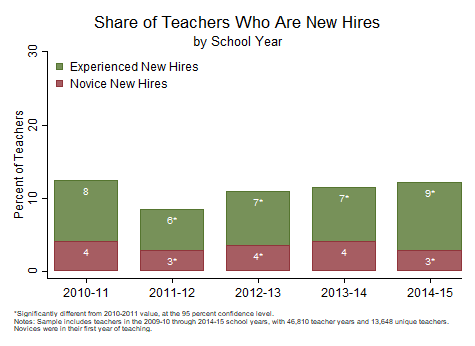
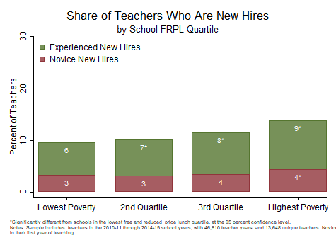

[OpenSDP Analysis](http://opensdp.github.io/analysis)  /  Human Capital Analysis: Recruitment

# Analyses

##[1. Calculate the Share of Teachers Who Are New Hires](Share_of_Teachers_Who_Are_New_Hires.html) {.chart-index-element}

Describes the overall shares of novice and experienced new hires.

##[2. Examine the Share of New Hires Across School Years](Share_of_Teachers_Who_Are_New_Hires_by_School_Year.html) {.chart-index-element}

Describes the share of novice and experienced new hires by year.

##[3. Compare the Shares of New Hires Across School Poverty Quartiles](Share_of_Teachers_Who_Are_New_Hires_by_School_Poverty_Level.html) {.chart-index-element}

Examines the extent to which new hires are distributed unevenly across the agency according to school poverty characteristics.

##[4. Examine the Distribution of Teachers and Students by Race](Share_of_Teachers_and_Students_by_Race.html) {.chart-index-element}

Compares the shares of all teachers, newly hired teachers, and students by race.

# Getting Started

###Objective

In this guide you will examine teacher hiring patterns, including the teaching experience of new hires, demographic characteristics of teachers and students, and the share of new hires by year and school poverty level.

###Using this Guide

The Human Capital Analysis series is a set of guides, code, and sample data about policy-relevant teacher workforce topics. Browse this and other guides in the series for ideas about ways to investigate critical points in teaching careers such as recruitment, placement, development, evaluation, and retention. Each guide includes several analyses in the form of charts together with Stata analysis and graphing code to generate each chart.

Once you've identified analyses that you want to replicate or modify, click the "Download" buttons to download Stata code and sample data. You can make changes to the charts using the code and sample data, or modify the code to work with your own data. If you're familiar with Github you can click "Go to Repository" and clone the entire Human Capital Analysis repository to your own computer.

###About the Data

The data visualizations in the Human Capital Analysis series use a synthetic dataset with six years of data for a fictitious school district. There is one record for each teacher in a given school year. Each record includes data about demographics, credentials, teaching experience, job assignments, evaluation scores, and new hire and retention status, as well as information about the schools to which teachers are assigned. The recruitment guide also uses a student data file for demographic information.

###About the Analyses

The recruitment process is the first opportunity education agencies have to secure highly effective teachers for their students. This guide documents the kinds of teachers the agency hires (e.g., novices and experienced new hires), their demographic characteristics, and their distribution within the agency. Analyzing recruitment trends can provide direction for a human resource strategy that aims to attract and place highly effective teachers in all classrooms.

###Giving Feedback on the Guide

This guide is an open-source document hosted on Github and generated using the R Statamarkdown package. We welcome feedback, corrections, additions, and updates. Please visit the OpenSDP human capital analysis repository to read our contributor guidelines.
