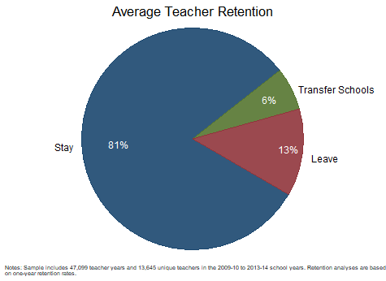
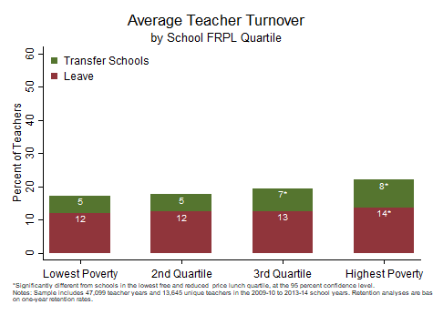

[OpenSDP Home]()  /  Human Capital Analysis: Retention

###Objective

Schools invest substantial resources recruiting, developing, and retaining high-quality teachers. These analyses reveal how retention patterns vary by school characteristics and by teacher effectiveness categories. Because novice teachers typically experience high rates of turnover, retention analyses often focus on the retention patterns of novice teachers.

###Using this Guide

The Human Capital Analysis: Retention series is a set of guides, code, and sample data about policy-relevant teacher retention topics. Each guide page includes an analysis in the form of a chart together with the Stata analysis and graphing code to generate the chart.

###About the Data

The data visualizations in this series use a synthetically generated sample data file.

### Contents

##[1. Average Annual Teacher Retention](Average_Annual_Teacher_Retention.html) {.chart-index-element}

Describes the overall annual shares of teachers who stay in the same school, transfer, and leave teaching in the agency.

##[2. Teacher Turnover by School Year](Teacher_Turnover_by_School_Year.html) {.chart-index-element}

Describes the shares of teachers who transfer and leave over time.

##[3. Teacher Turnover by School Poverty Quartile](Teacher_Turnover_by_School_Poverty_Quartile.html) {.chart-index-element}

Examines the extent to which retention patterns differ according to school poverty characteristics.

##[4. Teacher Turnover by Teacher Effectiveness Tercile](Teacher_Turnover_by_Teacher_Effectiveness_Tercile.html) {.chart-index-element}

Examines whether the most and least effective teachers are being differentially retained.

##[5. Novice Teacher Retention Trajectory](Novice_Teacher_Retention_Trajectory.html) {.chart-index-element}

Describes the retention trajectory of a cohort of novice teachers.
