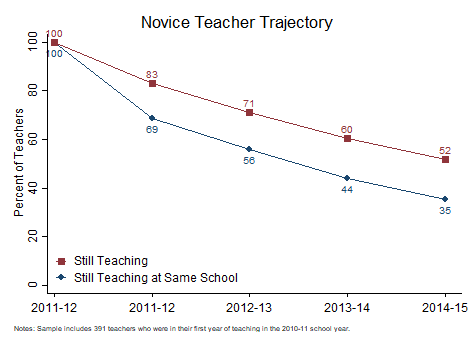

```{r, echo=FALSE, message=FALSE}
library(Statamarkdown)
stataexe <- find_stata()
knitr::opts_chunk$set(engine.path=stataexe)
```

```{stata, collectcode=TRUE, echo=FALSE, results="hide"}
// Close log file if open and set up environment

capture log close
clear all
set more off
set scheme s1color

// Edit the file path below to point to the directory with folders for data, logs,
// programs, and tables and figures. Change to that directory.

cd "C:\working_files\human-capital-stata"

// Define file locations

global analysis ".\data\analysis"
global graphs 	".\tables_figures"
global log 		".\logs"

// Open log file

log using "${log}\Analyze_Retention.txt", text replace

```

<div class="navbar navbar-default navbar-fixed-top" id="logo">
<div class="container">

</div>
</div>

[OpenSDP Home](opensdp.github.io) / [Human Capital Analysis: Retention](Human_Capital_Analysis_Retention.html) / Novice Teacher Retention Trajectory



###Preparation
####Purpose

Describe the retention trajectory of a cohort of novice teachers.

####Required analysis file variables

 - `tid`
 - `school_year`
 - `school_code`
 - `t_transfer`
 - `t_novice`


####Analysis-specific sample restrictions

 - Keep only years for which next-year retention status can be calculated.
 - Keep only records for teachers who were novices in the first year of data.


####Ask yourself

 - Does a sharp drop in retention occur in any one year? if so, what might be driving turnover at this stage of a teachers career?
 - What types of support does your agency provide to novice teachers and for how many years do early career teachers receive additional support?


####Potential further analyses

This approach can be used to generate a number of interesting analyses. For example, you can examine retention for all teachers instead of just novices. If sample size permits, you can investigate novice retention by certification pathway or by effectiveness tercile. This latter analysis is one of SDP's **Human Capital Strategic Performance Indicators**.

###Analysis

####Step 1: Load data.

```{stata, collectcode=TRUE, results="hide"}
use "${analysis}\Teacher_Year_Analysis.dta", clear
isid tid school_year
```


####Step 2: Restrict sample.

Restrict to years for which next-year retention status can be observed and to teacher records with non-missing novice indicators.

```{stata, collectcode=TRUE, results="hide"}
keep if school_year >= 2012 & school_year <= 2015
keep if !missing(t_novice)
```


####Step 3: Review variables.

```{stata, collectcode=TRUE, results="hide"}
tab school_year t_novice, mi
```


####Step 4: Make indicator for membership in novice cohort.

```{stata, collectcode=TRUE, results="hide"}
gen t_novice_2012 = school_year == 2012 & t_novice == 1
bysort tid: egen max_t_novice_2012 = max(t_novice_2012)
drop t_novice_2012
rename max_t_novice_2012 t_novice_2012
```


####Step 5: Restrict sample to novice cohort.

Drop observations of teachers who reappear after leaving for one or more school years.

```{stata, collectcode=TRUE, results="hide"}
keep if t_novice_2012 == 1
gen t_leave_year = school_year if t_leave == 1 
bysort tid: egen min_t_leave_year = min(t_leave_year)
drop if school_year > min_t_leave_year
```


####Step 6: Get sample size.

```{stata, collectcode=TRUE, results="hide"}
sum tid if school_year == 2012 
local unique_teachers = string(r(N), "%9.0fc")
```


####Step 7: Get initial school.

```{stata, collectcode=TRUE, results="hide"}
gen school_code_2012 = school_code if school_year == 2012
egen max_school_code_2012 = max(school_code_2012), by(tid)
replace school_code_2012 = max_school_code_2012
drop max_school_code_2012
```


####Step 8: Define outcome variables.

```{stata, collectcode=TRUE, results="hide"}
gen still_same_school = school_code == school_code_2012 
gen still_teach = 1
tab school_year still_same_school, mi
tab school_year still_teach, mi
```


####Step 9: Collapse to sum variables of interest.

```{stata, collectcode=TRUE, results="hide"}
collapse (sum) still_same_school still_teach (count) tid, by(school_year)
gen cohort_count_2012 = tid if school_year == 2012
egen max_cohort_count_2012 = max(cohort_count_2012)
replace cohort_count_2012 = max_cohort_count_2012
drop max_cohort_count_2012
```


####Step 10: Calculate outcome percentages by year.

```{stata, collectcode=TRUE, results="hide"}
foreach var in still_same_school still_teach {
	replace `var' = 100 * `var' / cohort_count_2012
	format `var' %9.0fc
}
```

####Step 11: Make chart.

```{stata, collectcode=TRUE, results="hide"}
sort school_year
#delimit ;
twoway
scatter still_same_school school_year, 
	connect(l) 
	lcolor(navy) 
	lpattern(solid) 
	msymbol(circle) 
	mcolor(navy) 
	msize(medium) 
	mlabel(still_same_school) 
	mlabpos(6) 
	mlabcolor(navy) 
	mlabsize(small) ||
	
	scatter still_teach school_year, 
	connect(l) 
	lcolor(maroon) 
	lpattern(solid) 
	msymbol(square) 
	mcolor(maroon) 
	mlabsize(small) 
	msize(medium) 
	mlabel(still_teach) 
	mlabpos(12) 
	mlabcolor(maroon) ||,
	
	title("Novice Teacher Trajectory", span)
	ytitle("Percent of Teachers", size(medsmall)) 
	xtitle("") 
	yscale(range(0(20)100)) 
	ylabel(0(20)100, nogrid format(%9.0f) labsize(medsmall)) 
	xscale(range(2012(.1)2015.1)) 
	xlabel(2012 "2011-12" 2013 "2012-13" 2014 "2013-14" 2015 "2014-15", 
		labsize(medsmall)) 
	legend(position(8) order(2 1) cols(1) symxsize(3) ring(0) size(medsmall) 
		region(lstyle(none) lcolor(none) color(none))
		label(1 "Still Teaching at Same School") 
		label(2 "Still Teaching"))
	
	graphregion(color(white) fcolor(white) lcolor(white)) plotregion(color(white) 
		fcolor(white) lcolor(white))
		
	note(" " "Notes: Sample includes `unique_teachers' teachers who were in their
first year of teaching in the 2011-12 school year.", span size(vsmall));

#delimit cr
```

####Step 12: Save chart.

```{stata, collectcode=TRUE, results="hide"}
graph save "$graphs\Novice_Teacher_Retention_Trajectory.gph", replace
graph export "$graphs\Novice_Teacher_Retention_Trajectory.emf", replace
```

```{stata, collectcode=TRUE, echo=FALSE, results="hide"}
graph export "docs\Novice_Teacher_Retention_Trajectory.png", replace
```

---

Previous Analysis: [Teacher Turnover by Teacher Effectiveness Tercile](Teacher_Turnover_by_Teacher_Effectiveness_Tercile.html)