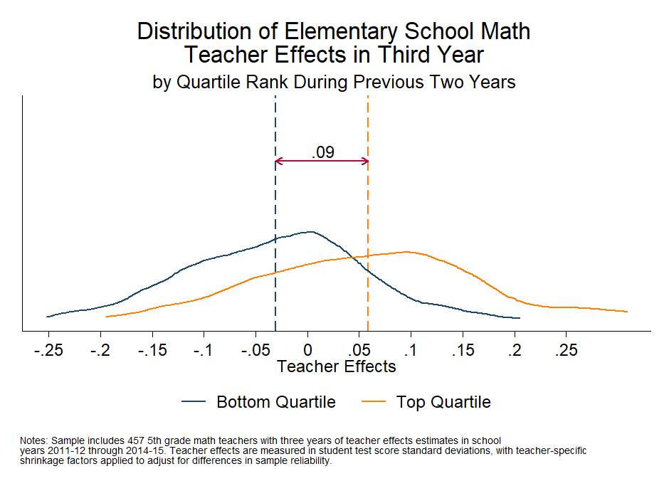

<div class="navbar navbar-default navbar-fixed-top" id="logo">
<div class="container">

</div>
</div>

[OpenSDP Analysis](http://opensdp.github.io/analysis) / [Human Capital Analysis: Evaluation](Human_Capital_Analysis_Evaluation.html) / Compare Distribution of Teacher Effects in Third Year



###Preparation
####Purpose

Examine the distribution of teacher effectiveness in a third year for teachers ranked most and least effective in the prior two years. 

####Required analysis file variables

 - `tid`
 - `school_year`
 - `school_lvl`
 - `curr2year_tre_m`
 - `current_tre_m`


####Analysis-specific sample restrictions

 - Keep only records for teachers with three years of effectiveness estimates in the given subject.  
 - If school_level restriction is chosen, keep only records for elementary or middle school teachers. 
 
 
####Ask yourself
 
- How well do rankings in the first two years predict teacher effectiveness in the third year? Do you see distinct, differentiated peaks in the two distributions? How much overlap is there between the two distributions? How likely are teachers to change effectiveness rankings from year to year?
 
####Potential further analyses

If you have sufficient sample size, you can restrict the sample to teachers in their third year at the agency to understand how performance of probationary teachers in their first two years compare to performance in the third year. 
###Analysis

####Step 1: Choose the subject and school level. 
Choose the subject (math [m] or ela [e]) and school level (elem or middle) for the analysis. Note: to make multiple charts at the same time, put loops for subject and level around the analysis and graphing code. To include all grade levels in the analysis, comment out the local level command below.


```stata
local subject m
local level elem
```

####Step 2: Load data.


```stata
use "${analysis}/Teacher_Year_Analysis.dta", clear
isid tid school_year
```

####Step 3: Restrict the sample.

Keep years for which teacher effects value added estimates are available. Keep only records for which teachers have pooled teacher effects estimates (pooled estimates use information from all available years for each teacher). If school level restriction is chosen, keep only records from either elementary or middle schools.


```stata
keep if school_year >= 2012 & school_year <= 2015
keep if !missing(current_tre_`subject')
keep if !(sch_high == 1)
if "`level'" == "elem" {	
	keep if sch_elem == 1
}
if "`level'" == "middle" {
	keep if sch_middle == 1
}
```

####Step 4: Review variables.


```stata
tab school_year
summ current_tre_`subject', detail 
summ curr2year_tre_`subject', detail
```


####Step 5: Create "year 3".

Identify the most recent year a teacher is present in the data and tag as "year 3."


```stata
egen max_school_year = max(school_year), by(tid)
gen year3 = max_school_year == school_year
drop max_school_year
tab year3, mi
```

####Step 6: Create time series. 

Set time series structure and use lead operators to identify years 2 and 1. 


```stata
tsset tid school_year	
gen year1 = 0
gen year2 = 0
bysort tid: replace year2 = 1 if F.year3 == 1
bysort tid: replace year1 = 1 if F.year2 == 1
tab year2 year3, mi
tab year1 year3, mi
```

####Step 7: Keep balanced panel. 

Keep a balanced panel which includes only teachers with observations for all 3 years.


```stata
bysort tid: egen balanced = max(year1)
keep if balanced == 1
drop balanced
unique tid
```

####Step 8: Assign teacher quartils. 

Assign teachers to quartiles based on two-year pooled teacher effects in year 2, and generate dummy variables for quartiles.


```stata
assert !missing(curr2year_tre_`subject') if year2 == 1
xtile quart_temp = curr2year_tre_`subject' if year2 == 1, nq(4)
bysort tid: egen quart = max(quart_temp)
tab quart if year2 == 1, mi
tab quart, gen(quart)
```

####Step 9: Drop extra records.

Drop records for years 1 and 2, reducing data to one record per teacher.


```stata
keep if year3 == 1
isid tid
```

####Step 10: Get sample size. 


```stata
sum tid
local unique_teachers = string(r(N), "%9.0fc")
```

####Step 11: Get quartile means and the difference between means for quartiles 1 and 4. 


```stata
forval quartile = 1/4 {
	summ current_tre_`subject' if quart == `quartile' 
	local mean_q`quartile' = r(mean)
}
local diff = round(`mean_q4' - `mean_q1', .01)
```

####Step 12: Set positions for lines and text on chart. 


```stata
local lnht = 8.5
local txtht = `lnht' + .5
local diff_pl = `mean_q1' + `diff' * .5
```

####Step 13: Define subject and school level titles.

```stata
if "`subject'" == "m" {
	local subj_foot "math"
	local subj_title "Math"
}

if "`subject'" == "e" {
	local subj_foot "English/Language Arts"
	local subj_title "ELA"
}
local gradespan "5th through 8th"

if "`level'" == "middle" {
	local subj_title "Middle School `subj_title'"
	local gradespan "6th through 8th"
}

if "`level'" == "elem" {
	local subj_title "Elementary School `subj_title'"
	local gradespan "5th"
}	
```

####Step 14: Make chart.

```stata
#delimit ;
twoway (pcarrowi `lnht' `mean_q4' `lnht' `mean_q1',
		color(cranberry) mlwidth(medthin) lwidth(medthin))
	(pcarrowi `lnht' `mean_q1' `lnht' `mean_q4',
		color(cranberry) mlwidth(medthin) lwidth(medthin))
	(kdensity current_tre_`subject' if quart == 1, 
		lcolor(navy) area(1) 
		xline(`mean_q1', lpattern(dash) lcolor(navy))) 	
	(kdensity current_tre_`subject' if quart == 4, 
		lcolor(orange) area(1) lwidth(medium)
		xline(`mean_q4', lpattern(dash) lcolor(orange))),
	text(`txtht' `diff_pl' "`diff'", placement(0))
	title("Distribution of `subj_title' Teacher Effects in Third Year", span)
	subtitle("by Quartile Rank During Previous Two Years", span)
	xtitle("Teacher Effects", size(medsmall))
		xscale(range(-.25(.05).25))
		xlabel(-.25(.05).25, labsize(medsmall))
	ytitle("",) 
		yscale(range(0(2)12)) 
		ylabel(none)
	legend(order(3 4) rows(1) label(3 "Bottom Quartile") 
		label(4 "Top Quartile"))
	legend(symxsize(5) ring(1) size(medsmall)
		region(lstyle(none) lcolor(none) color(none))) 
	graphregion(color(white) fcolor(white) lcolor(white))
	plotregion(color(white) fcolor(white) lcolor(white) margin(5 5 2 0))
	
	note(" " "Notes: Sample includes `unique_teachers' `gradespan' grade `subj_foot'
teachers with three years of teacher effects estimates in school" "years 2011-12 through
2014-15. Teacher effects are measured in student test score standard deviations, with
teacher-specific" "shrinkage factors applied to adjust for differences in sample
reliability.", span size(vsmall));
#delimit cr
```

####Step 15: Save chart.

```stata
graph save "${graphs}\Predictive_Tchr_Effects_Dist_`subj_title'.gph" , replace
graph export "${graphs}\Predictive_Tchr_Effects_Dist_`subj_title'.emf" , replace
```


---

Previous Analysis: [Examine the Predictiveness of Teacher Effects](Predictive_Teacher_Effects_Average.html)
