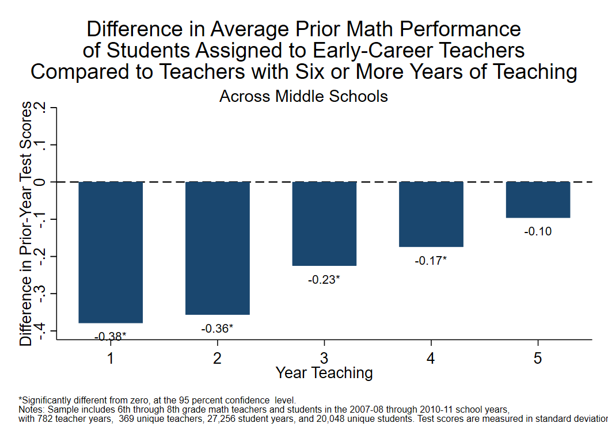
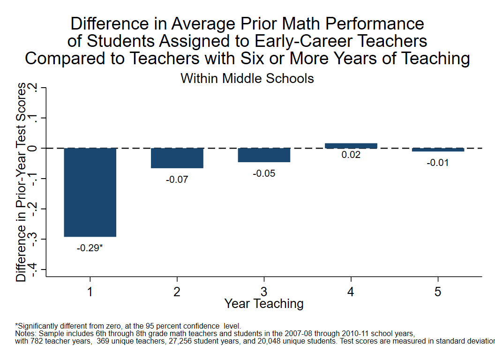

```{r, echo=FALSE, message=FALSE}
library(Statamarkdown)
stataexe <- find_stata()
knitr::opts_chunk$set(engine.path=stataexe)
```

```{stata, collectcode=TRUE, echo=FALSE, results="hide"}
// Close log file if open and set up environment

capture log close
clear all
set more off
set scheme s1color

// Edit the file path below to point to the directory with folders for data, logs,
// programs, and tables and figures. Change to that directory.

cd "C:\working_files\human-capital-stata"

// Define file locations

global analysis ".\data\analysis"
global graphs 	".\tables_figures"
global log 		".\logs"

// Open log file

log using "${log}\Analyze_Placement.txt", text replace

```

<div class="navbar navbar-default navbar-fixed-top" id="logo">
<div class="container">

</div>
</div>

[OpenSDP Analysis](http://opensdp.github.io/analysis) / [Human Capital Analysis: Placement](Human_Capital_Analysis_Placement.html) / Examine Student Prior Achievement and Teacher Experience

{width=49%}
{width=49%}

###Preparation
####Purpose

Examine how students are placed with teachers based on students' prior performance and teachers'
experience.

####Required analysis file variables

 - `sid`
 - `school_year`
 - `school_code`
 - `tid_math`
 - `cid_math`
 - `grade_level`
 - `t_experience`
 - `std_scaled_score_math_tm1`

####Analysis-specific sample restrictions

 - Restrict to classes included in value-added estimates.
 - Keep only grades and years for which prior-year test scores are available. 
 - Keep only students with a single identified current-year core course and prior-year test scor in the given subject.
 - If school-level restriction is chosen, keep only records for either elementary or middle schoool grades.

####Ask yourself

 - To what degree are the placement patterns driven by the concentration of novice teachers and lowerperforming students in certain schools? 
 - Do internal school politics infl uence placement patterns? Are there formal or informal arrangements that enable more senior teachers to choose their classroom assignments? Is there a norm within the agency that novice teachers need to "put in their time" with more diffi cult assignments? Do parents of higher-achieving students infl uence placements to well-known teachers?
- Are timing factors important? Are classroom rosters drawn up early in the summer? Are students who enroll late assigned to teachers hired just prior to the school year? 
- Are within-school gaps concentrated in certain schools? Are there some schools in which novice teachers are actually assigned to higher-achieving students?

####Potential further analyses

- This graph could be created for individual schools. 
- If meaningful placement patterns are observed in middle school, examine how courses teachers are assigned (e.g., remedial, honors, etc.) vary based on teaching experience.  

###Analysis

####Step 1: Choose the subject and school level.
Choose the subject (math or ela) and school level (elem or middle) for the analysis. Note: To change from math to ELA, switch the subjects in the next two lines. To make multiple charts at the same time, put loops for subject and level around the analysis and graphing code. To include all grade levels in the analysis, comment out the local level command below.

```{stata, collectcode=TRUE, results="hide"}
local subject math
local level middle
```

####Step 2: Load data. 

```{stata, collectcode=TRUE, results="hide"}
use "${analysis}\Student_Teacher_Year_Analysis.dta", clear  
isid sid school_year
```

####Step 3: Restrict the sample.
Keep years for which teacher effects value added estimates are available. Keep only records for which teachers have pooled teacher effects estimates (pooled estimates use information from all available years for each teacher). If school level restriction is chosen, keep only records from either elementary or middle schools.

```{stata, collectcode=TRUE, results="hide"}
keep if school_year >= 2008 & school_year <= 2011
keep if grade_level >= 5 & grade_level <= 8
keep if t_is_teacher == 1
keep if !missing(t_experience)
keep if !missing(cid_`subject')
keep if !missing(std_scaled_score_`subject', std_scaled_score_`subject'_tm1)
if "`level'" == "elem" {	
	keep if grade_level == 5
}
if "`level'" == "middle" {
	keep if grade_level >= 6 & grade_level <= 8
}
```

####Step 4: Review teacher and student variables.

```{stata, collectcode=TRUE, results="hide"}
tab school_year grade_level, mi
unique tid_`subject'
unique tid_`subject' school_year
bysort tid_`subject' school_year: gen tag = (_n == 1)
tab t_experience if tag == 1, mi
drop tag
table t_experience, c(mean std_scaled_score_`subject'_tm1)
codebook cid_`subject' tid_`subject' school_year t_experience ///
	std_scaled_score_`subject' std_scaled_score_`subject'_tm1 ///
	grade_level school_code 
```

####Step 5: Create teaching experience variables.
Create dummy variables for each year of teaching experience, putting all teachers with 10 or more years of experience in one group.

```{stata, collectcode=TRUE, results="hide"}
replace t_experience = 6 if t_experience > 5 & !missing(t_experience)
tab t_experience, gen(exp)
```

####Step 6: Generate effects variable.
Create variable for grade-by-year fixed effects.

```{stata, collectcode=TRUE, results="hide"}
egen grade_year = group(grade_level school_year)
```

####Step 7: Generate effects variable by school.
Define grade-by-year-by-school variable for fixed effects.

```{stata, collectcode=TRUE, results="hide"}
egen grade_year_school = group(school_code grade_level school_year)
```

####Step 8: Create results matrix.
Define 5 x 4 matrix to store results.

```{stata, collectcode=TRUE, results="hide"}
matrix results = J(5, 4, .)
matrix colnames results = across_school_coef across_school_se ///
	within_school_coef within_school_se
```

####Step 9: Calculate regression.
Do regression of prior student math score on teacher experience. Sixth plus year teachers are comparison group.
```{stata, collectcode=TRUE, results="hide"}
areg std_scaled_score_`subject'_tm1 exp1-exp5, robust cluster(cid_`subject') ///
	absorb(grade_year)
```

####Step 10: Get student and teacher sample sizes.
Identify other student variables to use as controls.

```{stata, collectcode=TRUE, results="hide"}
egen teacher_years = nvals(tid_`subject' school_year) if e(sample)
summ teacher_years
local teacher_years = string(r(mean), "%9.0fc")
egen unique_teachers = nvals(tid_`subject') if e(sample)
summ unique_teachers
local unique_teachers = string(r(mean), "%9.0fc")

egen student_years = nvals(sid school_year) if e(sample)
summ student_years
local student_years = string(r(mean), "%9.0fc")
egen unique_students = nvals(sid) if e(sample)
summ unique_students
local unique_students = string(r(mean), "%9.0fc")
```

####Step 11: Begin filling matrix.
Store coefficients in the first column and and standard errors in the second column of the results matrix.

```{stata, collectcode=TRUE, results="hide"}
matrix results[1, 1] = _b[exp1]
matrix results[2, 1] = _b[exp2]
matrix results[3, 1] = _b[exp3]
matrix results[4, 1] = _b[exp4]
matrix results[5, 1] = _b[exp5]

matrix results[1, 2] = _se[exp1]
matrix results[2, 2] = _se[exp2]
matrix results[3, 2] = _se[exp3]
matrix results[4, 2] = _se[exp4]
matrix results[5, 2] = _se[exp5]
```

####Step 12: Add school effects. 
Add school fixed effects to prior model to generate within school comparison.

```{stata, collectcode=TRUE, results="hide"}
areg std_scaled_score_`subject'_tm1 exp1-exp5, robust cluster(cid_`subject') ///
	absorb(grade_year_school)
```

####Step 13: Store coefficients and standard errors.
Put these values in columns 3 and 4 of the results matrix.
```{stata, collectcode=TRUE, results="hide"}
matrix results[1, 3] = _b[exp1]
matrix results[2, 3] = _b[exp2]
matrix results[3, 3] = _b[exp3]
matrix results[4, 3] = _b[exp4]
matrix results[5, 3] = _b[exp5]

matrix results[1, 4] = _se[exp1]
matrix results[2, 4] = _se[exp2]
matrix results[3, 4] = _se[exp3]
matrix results[4, 4] = _se[exp4]
matrix results[5, 4] = _se[exp5]
```

####Step 14: Use results data from matrix.
Clear data and replace with matrix contents. Add variable for year teaching.
```{stata, collectcode=TRUE, results="hide"}
clear
svmat results, names(col)
gen year_teaching = _n
```

####Step 15: Get and store significance.
Concatenate coefficient and asterisk to use as value label.

```{stata, collectcode=TRUE, results="hide"}
foreach model in across_school within_school {
	gen `model'_sig = abs(`model'_coef / `model'_se)
}
foreach var of varlist across_school_sig within_school_sig {
	replace `var' = 0 if `var' < =1.96
	replace `var' = 1 if `var' > 1.96
	tostring `var', replace
	replace `var' = "" if `var' == "0"
	replace `var' = "*" if `var' == "1"
}

foreach model in across_school within_school {
	gen `model'_string = string(`model'_coef, "%9.2f")
	egen `model'_label = concat(`model'_string `model'_sig)
}
```

####Step 16: Define titles for subject and school level.

```{stata, collectcode=TRUE, results="hide"}
if "`subject'" == "math" { 
	local subj_title "Math" 
	local subj_foot "math" 
}
if "`subject'"=="ela" {
	local subj_title "ELA"
	local subj_foot "English/Language Arts"
} 

local gradespan "5th through 8th"

if "`level'" == "middle" {
	local level_title "Middle "
	local gradespan "6th through 8th"
}

if "`level'" == "elem" {
	local level_title "Elementary "
	local gradespan "5th"
}
```

####Step 17: Begin loop for making charts.
Start loop through models to make and save across and within schools charts.

```{stata, collectcode=TRUE, results="hide"}
foreach model in across within {
```

####Step 18: Define subtitle. 

```{stata, collectcode=TRUE, results="hide"}
  if "`model'" == "across" {
  	local subtitle "Across `level_title'Schools"
  }
  if "`model'" == "within" {
  	local subtitle "Within `level_title'Schools"
  }
```

####Step 19: Make chart.
Bar chart gives average score difference relative to 6th plus year teachers, while scatter plot places value and significance asterisk as marker label below bar. Marker symbol is invisible.

```{stata, collectcode=TRUE, results="hide"}
  #delimit ;
  twoway bar `model'_school_coef year_teaching, 
  	barwidth(.6) color(navy) finten(100) ||
  	
  scatter `model'_school_coef year_teaching, 
  	mlabel(`model'_school_label) 
  	msymbol(i) 
  	mlabpos(6) 
  	mlabcolor(black) ||,
  	
  	ytitle("Difference in Prior-Year Test Scores", size(medsmall)) 
  	title("Difference in Average Prior `subj_title' Performance"
  		"of Students Assigned to Early-Career Teachers"
  		"Compared to Teachers with Six or More Years of Teaching", span) 
  	subtitle("`subtitle'", span) 
  	xtitle("Year Teaching", size(medsmall)) 
  	xlabel(,labsize(medsmall))
  	legend(off) 
  
  	yline(0, lpattern(dash) lcolor(black)) 
  	yscale(range(-.4 .2)) 
  	ylabel(-.4(.1).2, nogrid labsize(medsmall)) 
  	ytick(-.4(.1).2) 
  	graphregion(color(white) fcolor(white) lcolor(white))
  	plotregion(color(white) fcolor(white) lcolor(white) margin(5 5 2 0))
  	
  	note(" " "*Significantly different from zero, at the 95 percent confidence 
  level." "Notes: Sample includes `gradespan' grade `subj_foot' teachers and students in
  the 2007-08 through 2010-11 school years," "with `teacher_years' teacher years, 
  `unique_teachers' unique teachers, `student_years' student years, and `unique_students'
  unique students. Test scores are measured in standard deviations.", size(vsmall) span);	
  
  #delimit cr
```

####Step 20: Save chart.
```{stata, collectcode=TRUE, results="hide"}
  graph export "${graphs}/Prior_Ach_by_Exp_`subtitle'_`subj_title'.emf", replace 
  graph save "${graphs}/Prior_Ach_by_Exp_`subtitle'_`subj_title'.gph", replace
```

```{stata, collectcode=TRUE, echo=FALSE, results="hide"}
  graph export "${docs}/Prior_Ach_by_Exp_`subtitle'_`subj_title'.png", replace
```

####Step 21: Close loop. 
```{stata, collectcode=TRUE, results="hide"}
}
```

---

Previous Analysis: [Inspect Teacher Characteristics by School Poverty](Teacher_Char_by_School_Poverty.html)
