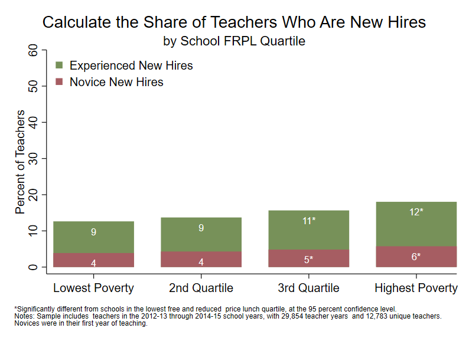

```{r, echo=FALSE, message=FALSE}
library(Statamarkdown)
stataexe <- find_stata()
knitr::opts_chunk$set(engine.path=stataexe)
```

```{stata, collectcode=TRUE, echo=FALSE, results="hide"}
// Close log file if open and set up environment

capture log close
clear all
set more off
set scheme s1color

// Edit the file path below to point to the directory with folders for data, logs,
// programs, and tables and figures. Change to that directory.

cd "C:\working_files\human-capital-stata"

// Define file locations

global analysis ".\data\analysis"
global graphs 	".\tables_figures"
global log 		".\logs"

// Open log file

log using "${log}\Analyze_Retention.txt", text replace

```

<div class="navbar navbar-default navbar-fixed-top" id="logo">
<div class="container">

</div>
</div>

[OpenSDP Home]() / [Human Capital Analysis: Recruitment](Human_Capital_Analysis_Recruitment.html) / Share of Teachers Who Are New Hires by School Poverty Level



###Preparation
####Purpose

Examine the extent to which new hires are distributed unevenly across the agency according to school characteristics.

####Required analysis file variables

 - `tid`
 - `school_year`
 - `t_new_hire`
 - `t_novice`
 - `school_poverty_quartile`


####Analysis-specific sample restrictions

 - Keep only years for which new hire information is available.


####Ask yourself

 - How do hiring patterns differ between high and low-poverty schools?
 - Are the shares of novice and veteran hires distributed equitably and strategically across school poverty quartiles?


####Potential further analyses

You can use a version of this graph to look at how new hires are distributed across other quartiles of school characteristics. For example, you can examine new hiring by school average test score quartile, or school minority percent quartile.


###Analysis

####Step 1: Load the Teacher_Year_Analysis data file.

```{stata, collectcode=TRUE, results="hide"}
use "${analysis}\Teacher_Year_Analysis.dta", clear
isid tid school_year
```

```{stata, collectcode=TRUE, results="hide", echo=FALSE}
// Generate missing school_poverty_quartile

preserve

	keep school_code school_year sch_frpl_pct
	drop if mi(school_code) | mi(school_year) | mi(sch_frpl_pct)
	collapse (mean) sch_frpl_pct, by(school_code school_year)
	isid school_code school_year
	gen school_poverty_quartile = .
	forval year = 2012/2015 {
		xtile temp_poverty_quartile = sch_frpl_pct if school_year == `year', nq(4)
		replace school_poverty_quartile = temp_poverty_quartile if school_year == `year'
		drop temp_poverty_quartile
	}
	assert !missing(school_poverty_quartile)
	label define pvt 1 "Lowest percentage of FRPL-eligible students"
	label define pvt 2 "Second-lowest percentage of FRPL-eligible students" , add
	label define pvt 3 "Second-highest percentage of FRPL-eligible students" , add
	label define pvt 4 "Highest percentage of FRPL-eligible students", add
	label values school_poverty_quartile pvt
	drop sch_frpl_pct

	tempfile school_poverty_qrt
	save `school_poverty_qrt'

restore
merge m:1 school_code school_year using `school_poverty_qrt', keep(1 2 3) nogen	
```

####Step 2: Restrict the analysis sample.

Also generate veteran new hire indicator.

```{stata, collectcode=TRUE, results="hide"}
keep if school_year > 2012
keep if !missing(t_new_hire)
keep if !missing(t_novice)

keep if !missing(school_poverty_quartile)
	
// Generate missing t_veteran_new_hire variable
gen t_veteran_new_hire = 0 if !missing(t_experience)
replace t_veteran_new_hire = 1 if t_new_hire == 1 & t_novice == 0 & !missing(t_experience)

assert !missing(t_experience, t_veteran_new_hire)
```


####Step 3: Review variables used in the analysis.

```{stata, collectcode=TRUE, results="hide"}
tab school_poverty_quartile, mi
tab school_poverty_quartile t_novice, mi row
tab school_poverty_quartile t_veteran_new_hire, mi row
```


####Step 4: Calculate sample size.

```{stata, collectcode=TRUE, results="hide"}
summ tid
local teacher_years = string(r(N), "%9.0fc")
preserve 
	bys tid: keep if _n == 1
	summ tid
	local unique_teachers = string(r(N), "%9.0fc")
restore
```


####Step 5: Calculate significance indicator variables by school poverty quartile.

```{stata, collectcode=TRUE, results="hide"}
foreach var of varlist t_novice t_veteran_new_hire {
	gen sig_`var' = .
	xi: reg `var' i.school_poverty_quartile, robust
	forval quart = 2/4 {
		replace sig_`var' = abs(_b[_Ischool_po_`quart']/_se[_Ischool_po_`quart']) ///
			if school_poverty_quartile == `quart'
		replace sig_`var' = 0 if sig_`var' <= 1.96 & school_poverty_quartile ==`quart'
		replace sig_`var' = 1 if sig_`var' > 1.96 & school_poverty_quartile == `quart'
	}
	replace sig_`var' = 0 if school_poverty_quartile == 1
}	
```


####Step 6: Collapse to calculate shares of new hires in each quartile.

```{stata, collectcode=TRUE, results="hide"}
collapse (mean) t_novice t_veteran_new_hire sig_*, by(school_poverty_quartile)
foreach var of varlist t_novice t_veteran_new_hire {
	replace `var' = 100 * `var'
}
```


####Step 7: Concatenate values and significance asterisks to value labels.

```{stata, collectcode=TRUE, results="hide"}
foreach var of varlist t_novice t_veteran_new_hire {
	tostring(sig_`var'), replace
	replace sig_`var' = "*" if sig_`var' == "1"
	replace sig_`var' = "" if sig_`var' == "0"
	gen `var'_str = string(`var', "%9.0f")
	egen `var'_label = concat(`var'_str sig_`var')
}
```


####Step 8: Get the total new hire percent for each year for graphing.

```{stata, collectcode=TRUE, results="hide"}
gen t_total = t_novice + t_veteran_new_hire
```


####Step 9: Create a bar graph.

Use twoway bar and scatter for the labels.

```{stata, collectcode=TRUE, results="hide"}
#delimit ;
twoway (bar t_total school_poverty_quartile, 
		fcolor(forest_green) lcolor(forest_green) lwidth(0) barwidth(0.75))
	(bar t_novice school_poverty_quartile, 
		fcolor(maroon) lcolor(maroon) lwidth(0) barwidth(0.75)) 
	(scatter t_total school_poverty_quartile, 
		mcolor(none) mlabel(t_veteran_new_hire_label) mlabcolor(white) mlabpos(6)  
		mlabsize(small)) 
	(scatter t_novice school_poverty_quartile, 
		mcolor(none) mlabel(t_novice_label) mlabcolor(white) mlabpos(6)  
		mlabsize(small)), 
	title("Share of Teachers Who Are New Hires", span) 
	subtitle("by School FRPL Quartile", span) 
	ytitle("Percent of Teachers") 
	ylabel(0(10)60, nogrid labsize(medsmall)) 
	xtitle("") 
	xlabel(1 "Lowest Poverty" 2 "2nd Quartile" 3 "3rd Quartile" 4 "Highest Poverty", 
		labsize(medsmall)) 
	legend(order(1 "Experienced New Hires" 2 "Novice New Hires")
		ring(0) position(11) symxsize(2) symysize(2) rows(2) size(medsmall) 
		region(lstyle(none) lcolor(none) color(none))) 
	graphregion(color(white) fcolor(white) lcolor(white)) 
	plotregion(color(white) fcolor(white) lcolor(white) margin(2 0 2 0))
	note(" " "*Significantly different from schools in the lowest free and reduced 
price lunch quartile, at the 95 percent confidence level." "Notes: Sample includes 
teachers in the 2012-13 through 2014-15 school years, with `teacher_years' teacher years 
and `unique_teachers' unique teachers."
"Novices were in their first year of teaching.", size(vsmall) span);
#delimit cr
```


####Step 10: Save the chart in Stata Graph and EMF formats.

If marker labels need to be moved by hand using Stata Graph Editor, re-save .gph and .emf files after editing.

```{stata, collectcode=TRUE, results="hide"}
	graph export "${graphs}/New_Hires_by_Poverty_Quartile.emf", replace 
	graph save "${graphs}/New_Hires_by_Poverty_Quartile.gph", replace 
```

```{stata, collectcode=TRUE, echo=FALSE, results="hide"}
graph export "docs\Share_of_Teachers_Who_Are_New_Hires_by_School_Poverty_Level.png", replace
```

---

Previous Analysis: [Share of Teachers Who Are New Hires](Share_of_Teachers_Who_Are_New_Hires_by_School_Year.html)

Next Analysis: [next]()
