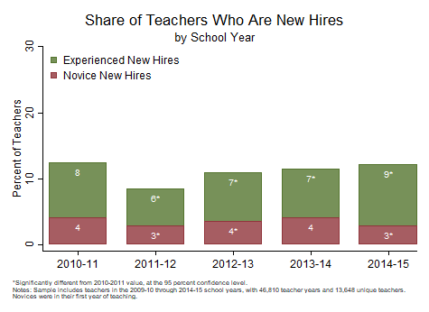

```{r, echo=FALSE, message=FALSE}
library(Statamarkdown)
stataexe <- find_stata()
knitr::opts_chunk$set(engine.path=stataexe)
```

```{stata, collectcode=TRUE, echo=FALSE, results="hide"}
// Close log file if open and set up environment

capture log close
clear all
set more off
set scheme s1color

// Edit the file path below to point to the directory with folders for data, logs,
// programs, and tables and figures. Change to that directory.

cd "C:\working_files\human-capital-stata"

// Define file locations

global analysis ".\data\analysis"
global graphs 	".\tables_figures"
global log 		".\logs"

// Open log file

log using "${log}\Analyze_Retention.txt", text replace

```

<div class="navbar navbar-default navbar-fixed-top" id="logo">
<div class="container">

</div>
</div>

[OpenSDP Home]() / [Human Capital Analysis: Recruitment](Human_Capital_Analysis_Recruitment.html) / Share of Teachers Who Are New Hires by School Year



###Preparation
####Purpose

Examine trends in hiring over time.

####Required analysis file variables

 - `tid`
 - `school_year`
 - `t_new_hire`
 - `t_novice`


####Analysis-specific sample restrictions

 - Keep only years for which new hire information is available.


####Ask yourself

 - How have hiring trends changed over time?
 - What factors might account for the trends that I see?


####Potential further analyses

At the state level, yout may wish to exammine hiring trends by year for specific school types or geographic areas. At the district level, you can make a graph of this type in order to examine overall hiring by school or for specific groups of schools, instead of by year.


###Analysis

####Step 1: Load the Teacher_Year_Analysis data file.

```{stata, collectcode=TRUE, results="hide"}
use "${analysis}\Teacher_Year_Analysis.dta", clear
isid tid school_year
```


####Step 2: Restrict the analysis sample.

Also generate veteran new hire indicator.

```{stata, collectcode=TRUE, results="hide"}
keep if school_year > 2012
keep if !missing(t_new_hire)
keep if !missing(t_novice)
	
// Generate missing t_veteran_new_hire variable
gen t_veteran_new_hire = 0 if !missing(t_experience)
replace t_veteran_new_hire = 1 if t_new_hire == 1 & t_novice == 0 & !missing(t_experience)

assert !missing(t_experience, t_veteran_new_hire)
```


####Step 3: Review variables to be used in the analysis.

```{stata, collectcode=TRUE, results="hide"}
tab school_year t_novice, mi row
tab school_year t_veteran_new_hire, mi row
tab t_novice t_veteran_new_hire
```


####Step 4: Calculate sample size.

```{stata, collectcode=TRUE, results="hide"}
summ tid
local teacher_years = string(r(N), "%9.0fc")
preserve 
	bys tid: keep if _n == 1
	summ tid
	local unique_teachers = string(r(N), "%9.0fc")
restore
```


####Step 5: Calculate significance indicator variables by year.

```{stata, collectcode=TRUE, results="hide"}
foreach var in t_novice t_veteran_new_hire {
	gen sig_`var' = .
	xi: logit `var' i.school_year, robust

	forvalues year = 2014/2015 {
		replace sig_`var' = abs(_b[_Ischool_ye_`year'] / _se[_Ischool_ye_`year']) ///
			if school_year == `year'
		replace sig_`var' = 0 if sig_`var' <= 1.96 & school_year == `year'
		replace sig_`var' = 1 if sig_`var' > 1.96 & school_year == `year'
	}
	replace sig_`var' = 0 if school_year == 2013
}
```


####Step 6: Collapse the teacher-level data file.

Do this to calculate percent of new hires by year.

```{stata, collectcode=TRUE, results="hide"}
collapse (mean) t_novice t_veteran_new_hire sig_*, by(school_year)
foreach var in t_novice t_veteran_new_hire {
	replace `var' = 100 * `var'
}
```


####Step 7: Concatenate values and significance asterisks to make value labels.

```{stata, collectcode=TRUE, results="hide"}
foreach var of varlist t_novice t_veteran_new_hire {
	tostring(sig_`var'), replace
	replace sig_`var' = "*" if sig_`var' == "1"
	replace sig_`var' = "" if sig_`var' == "0"
	gen `var'_str = string(`var', "%9.0f")
	egen `var'_label = concat(`var'_str sig_`var')
}
```


####Step 8: Get the total new hire percent for each year for graphing.

```{stata, collectcode=TRUE, results="hide"}
gen t_total = t_novice + t_veteran_new_hire
```


####Step 9: Create a stacked bar graph using overlaid bars.

Use scatter plots with invisible symbols for the value labels.

```{stata, collectcode=TRUE, results="hide"}
#delimit ;
twoway (bar t_total school_year, 
		fcolor(forest_green) lcolor(forest_green) lwidth(0) barwidth(0.75))
	(bar t_novice school_year, 
		fcolor(maroon) lcolor(maroon) lwidth(0) barwidth(0.75)) 
	(scatter t_total school_year, 
		mcolor(none) mlabel(t_veteran_new_hire_label) mlabcolor(white) mlabpos(6)  
		mlabsize(small)) 
	(scatter t_novice school_year, 
		mcolor(none) mlabel(t_novice_label) mlabcolor(white) mlabpos(6)  
		mlabsize(small)), 
	title("Share of Teachers Who Are New Hires", span) 
	subtitle("by School Year", span) 
	ytitle("Percent of Teachers") 
	ylabel(0(10)60, nogrid labsize(medsmall)) 
	xtitle("") 
	xlabel(2013 "2012-13" 2014 "2013-14" 2015 "2014-15", 
		labsize(medsmall)) 
	legend(order(1 "Experienced New Hires" 2 "Novice New Hires")
		ring(0) position(11) symxsize(2) symysize(2) rows(2) size(medsmall) 
		region(lstyle(none) lcolor(none) color(none))) 
	graphregion(color(white) fcolor(white) lcolor(white)) 
	plotregion(color(white) fcolor(white) lcolor(white) margin(2 0 2 0))
	note(" " "*Significantly different from 2012-2013 value, at the 95 percent confidence level."
    "Notes: Sample includes teachers in the 2012-13 through 2014-15 school years, with `teacher_years' teacher years and `unique_teachers' unique teachers." 
    "Novices were in their first year of teaching.", size(vsmall) span);
#delimit cr
```


####Step 10: Save the chart in Stata Graph and EMF formats.

```{stata, collectcode=TRUE, results="hide"}
	graph export "${graphs}/New_Hires_by_School_Year.emf", replace 
	graph save "${graphs}/New_Hires_by_School_Year.gph", replace 
```

```{stata, collectcode=TRUE, echo=FALSE, results="hide"}
graph export "docs\Share_of_Teachers_Who_Are_New_Hires_by_School_Year.png", replace
```

---

Previous Analysis: [Share of Teachers Who Are New Hires](Share_of_Teachers_Who_Are_New_Hires.html)
