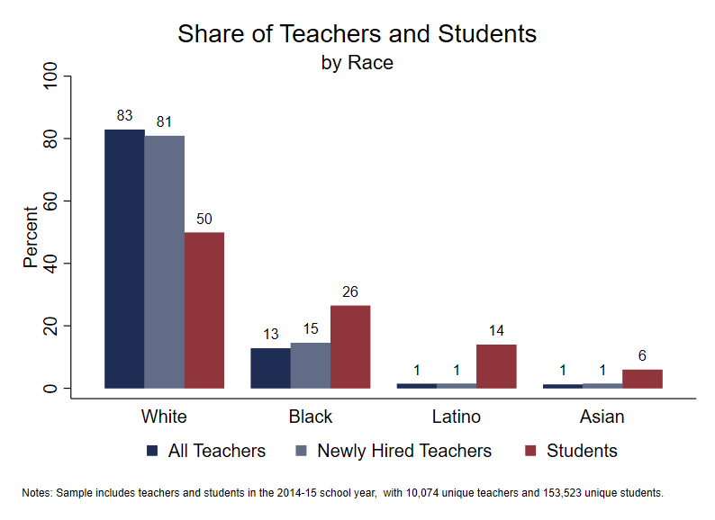

```{r, echo=FALSE, message=FALSE}
library(Statamarkdown)
stataexe <- find_stata()
knitr::opts_chunk$set(engine.path=stataexe)
```

```{stata, collectcode=TRUE, echo=FALSE, results="hide"}
// Close log file if open and set up environment

capture log close
clear all
set more off
set scheme s1color

// Edit the file path below to point to the directory with folders for data, logs,
// programs, and tables and figures. Change to that directory.

cd "C:\working_files\human-capital-stata"

// Define file locations

global analysis ".\data\analysis"
global graphs 	".\tables_figures"
global log 		".\logs"

// Open log file

log using "${log}\Analyze_Recruitment.txt", text replace

```

<div class="navbar navbar-default navbar-fixed-top" id="logo">
<div class="container">

</div>
</div>

[OpenSDP Analysis](http://opensdp.github.io/analysis) / [Human Capital Analysis: Recruitment](Human_Capital_Analysis_Recruitment.html) / Examine the Distribution of Teachers and Students by Race



###Preparation
####Purpose

Compares the shares of all teachers, newly hired teachers, and students by race.

####Required analysis file variables

 - `tid`
 - `school_year`
 - `t_new_hire`
 - `t_race_ethnicity`
 - `sid`
 - `s_race_ethnicity`


####Analysis-specific sample restrictions

 - For the student and teacher samples, keep only records for which race information is not missing.
 - For the student and teacher samples, keep only years for which teacher new hire information is available.


####Ask yourself

 - Is the racial composition of your teacher workforce similar to the racial composition of your student body? Is there a difference in racial composition between all teachers and newly hired teachers?
 - If there is a difference between teachers and students, what impact might this have on student learning?


####Potential further analyses

You may wish to replicate this analysis for specific schools or groups of schools.


###Analysis


####Step 1: Set up a matrix to hold teacher, new teacher, and student results.

```{stata, collectcode=TRUE, results="hide"}
matrix race = J(4, 4, .)
matrix colnames race = race teacher new_teacher student
```


####Step 2: Load the Teacher_Year_Analysis data file.

```{stata, collectcode=TRUE, results="hide"}
use "${analysis}\Teacher_Year_Analysis.dta", clear
isid tid school_year
```


####Step 3: Create dummy variables for major teacher race/ethnicity categories.

```{stata, collectcode=TRUE, results="hide"}
gen t_black = (t_race_ethnicity == 1)
gen t_asian = (t_race_ethnicity == 2)
gen t_latino = (t_race_ethnicity == 3)
gen t_white = (t_race_ethnicity == 5)
```

####Step 4: Restrict the teacher sample.

```{stata, collectcode=TRUE, results="hide"}
keep if school_year == 2015
keep if !missing(t_race_ethnicity)
keep if !missing(t_new_hire)
```


####Step 5: Review teacher variables.

```{stata, collectcode=TRUE, results="hide"}
tab school_year t_race_ethnicity, mi
tab t_new_hire t_white, mi row
tab t_new_hire t_black, mi row
tab t_new_hire t_latino, mi row
tab t_new_hire t_asian, mi row
```


####Step 6: Get teacher sample sizes.

```{stata, collectcode=TRUE, results="hide"}
summ tid
local teacher_years = string(r(N), "%6.0fc")
preserve 
	bys tid: keep if _n == 1
	summ tid
	local unique_teachers = string(r(N), "%6.0fc")
restore
```


####Step 7: Store percentages by race for all teachers and newly hired teachers.

```{stata, collectcode=TRUE, results="hide"}
local i = 1
foreach race of varlist t_white t_black t_latino t_asian {
	matrix race[`i', 1] = `i'
	summ `race'
	matrix race[`i', 2] = 100 * r(mean)
	summ `race' if t_new_hire == 1
	matrix race[`i', 3] = 100 * r(mean)
	local i = `i' + 1
}
```


####Step 8: Load the Student_School_Year data file to get student data.

```{stata, collectcode=TRUE, results="hide"}
use "${analysis}\Student_School_Year.dta", clear
```


####Step 9: Make the file unique by sid and school_year.

```{stata, collectcode=TRUE, results="hide"}
keep sid school_year s_race_ethnicity
duplicates drop
isid sid school_year
```


####Step 10: Restrict the student sample.

```{stata, collectcode=TRUE, results="hide"}
keep if school_year == 2015
keep if !missing(s_race_ethnicity)
```


####Step 11: Review student variables.

```{stata, collectcode=TRUE, results="hide"}
tab school_year s_race_ethnicity, mi
```


####Step 12: create dummy variables for major student race/ethnicity categories.

```{stata, collectcode=TRUE, results="hide"}
gen s_black = (s_race_ethnicity == 1)
gen s_asian = (s_race_ethnicity == 2)
gen s_latino = (s_race_ethnicity == 3)
gen s_white = (s_race_ethnicity == 5)
```


####Step 13: Get student sample sizes.

```{stata, collectcode=TRUE, results="hide"}
summ sid
local student_years = string(r(N), "%9.0fc")
preserve
	bys sid: keep if _n == 1
	summ sid
	local unique_students = string(r(N), "%9.0fc")
restore
```


####Step 14: Store percentages by race for students.

```{stata, collectcode=TRUE, results="hide"}
local i = 1
foreach race of varlist s_white s_black s_latino s_asian{
	summ `race'
	matrix race[`i', 4] = 100 * r(mean)
	local i = `i' + 1
}
```


####Step 15: Replace the dataset with the matrix of results.

```{stata, collectcode=TRUE, results="hide"}
clear 
svmat race, names(col)
```


####Step 15: Graph the results.

```{stata, collectcode=TRUE, results="hide"}
#delimit ;
graph bar teacher new_teacher student, 
	bar(1, fcolor(dknavy) lcolor(dknavy)) 
	bar(2, fcolor(dknavy*.7) lcolor(dknavy*.7)) 
	bar(3, fcolor(maroon) lcolor(maroon))
	blabel(bar, position(outside) color(black) format(%10.0f))
	over(race, relabel(1 "White" 2 "Black" 3 "Latino" 4 "Asian") 
		label(labsize(medsmall)))
	title("Share of Teachers and Students", span)
	subtitle("by Race", span)
	ytitle("Percent", size(medsmall))
	ylabel(0(20)100, labsize(medsmall) nogrid)
	legend(order(1 "All Teachers" 2 "Newly Hired Teachers" 3 "Students")
		position(6) symxsize(2) symysize(2) rows(1)
		size(medsmall) region(lstyle(none) lcolor(none) color(none)))
	graphregion(color(white) fcolor(white) lcolor(white))
	plotregion(color(white) fcolor(white) lcolor(white) margin(5 5 2 0))
	note(" " "Notes: Sample includes teachers and students in the 2014-15 school year, 
with `unique_teachers' unique teachers and `unique_students' unique students.", size(vsmall) 
span);		
#delimit cr
```


####Step 1: Save the chart in Stata Graph and EMF formats.

```{stata, collectcode=TRUE, results="hide"}
graph export "${graphs}/Share_Teachers_Students_by_Race.emf", replace
graph save "${graphs}/Share_Teachers_Students_by_Race.gph", replace
```

```{stata, collectcode=TRUE, echo=FALSE, results="hide"}
graph export "docs\Share_of_Teachers_and_Students_by_Race.png", replace
```

---

Previous Analysis: [Compare the Shares of New Hires Across School Poverty Quartiles](Share_of_Teachers_Who_Are_New_Hires_by_School_Poverty_Level.html)
