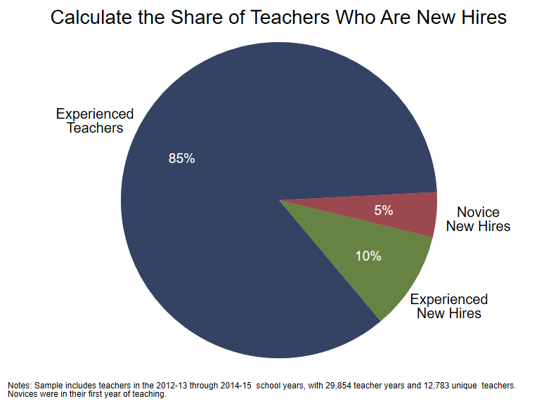

<div class="navbar navbar-default navbar-fixed-top" id="logo">
<div class="container">

</div>
</div>

[OpenSDP Analysis](http://opensdp.github.io/analysis) / [Human Capital Analysis: Recruitment](Human_Capital_Analysis_Recruitment.html) / Calculate the Share of Teachers Who Are New Hires



###Preparation
####Purpose

Describe the share of teachers in the agency who are new hires.

####Required analysis file variables

 - `tid`
 - `school_year`
 - `t_new_hire`
 - `t_novice`


####Analysis-specific sample restrictions

 - Keep only years for which new hire information is available.


####Ask yourself

 - How is your workforce balanced between novice and veteran teachers? Is the ratio what you expected?
 - What are the major sources of novice new hires in your agency? Experienced new hires?
 - How does your recruiting strategy affect the composition of your teacher workforce?


####Potential further analyses

You can use a pie chart like this one to examine the overall distribution of various characteristics of your teacher workforce. For example, you can use a pie chart to examine categorical variables such as teacher gender, race, or tenure status, or group continuous variables such as in-district experience, total teaching experience, or teacher age into three to seven categories and then display the share of teachers in each category.


###Analysis

####Step 1: Load the Teacher_Year_Analysis data file.


```stata
use "${analysis}\Teacher_Year_Analysis.dta", clear
isid tid school_year
```


####Step 2: Restrict the analysis sample.

Drop the first year of data, since new hires are not defined for that year. Drop records with missing values for variables important to the analysis.


```stata
keep if school_year > 2010
keep if !missing(t_new_hire)
keep if !missing(t_novice)
assert !missing(t_experience)
```


####Step 3: Review variables.


```stata
tab t_new_hire, mi
tab t_novice, mi
tab t_novice t_new_hire, mi col
```


####Step 4: Define a new variable which includes both novice and experienced new hires.


```stata
gen pie_hire = .
replace pie_hire = 1 if t_new_hire == 0
replace pie_hire = 2 if t_new_hire == 1 & t_novice == 1
replace pie_hire = 3 if t_new_hire == 1 & t_novice == 0
tab pie_hire, mi
```


####Step 5: Calculate and store sample sizes for the chart footnote.


```stata
summ tid
local teacher_years = string(r(N), "%9.0fc")
preserve 
	bys tid: keep if _n == 1
	summ tid
	local unique_teachers = string(r(N), "%9.0fc")
restore
```


####Step 6: Create a pie chart.

Footnote text is flush lect to allow wrapping lines without inserting tabs in footnote.


```stata
#delimit ;
graph pie, over (pie_hire) angle(-50) 	
	pie(1, color(dknavy))
	pie(2, color(maroon))
	pie(3, color(forest_green))
	plabel(_all percent, format(%3.0f) color(white) size(*1.2))
	plabel(1 "Experienced" "Teachers", gap(30) color(black) size(medsmall))
	plabel(2 "Novice" "New Hires", gap(30) color(black) size(medsmall))
	plabel(3 "Experienced" "New Hires", gap(30) color(black) size(medsmall))
	legend(off)
	graphregion(color(white) fcolor(white) lcolor(white))
	plotregion(color(white) fcolor(white) lcolor(white) margin(1 1 3 3))
	title("Calculate the Share of Teachers Who Are New Hires", span)
	note(" " "Notes: Sample includes teachers in the 2010-11 through 2014-15 
school years, with `teacher_years' teacher years and `unique_teachers' unique 
teachers." "Novices were in their first year of teaching.", size(vsmall) span);
#delimit cr
```


####Step 7: Save the chart in Stata Graph and EMF formats.


```stata
graph export "${graphs}/Share_of_Teachers_New_Hires.emf", replace 
graph save "${graphs}/Share_of_Teachers_New_Hires.gph", replace 
```


---

Next Analysis: [Examine the Share of New Hires Across School Years](Share_of_Teachers_Who_Are_New_Hires_by_School_Year.html)
