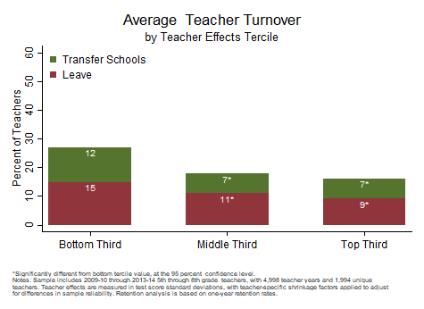

```{r, echo=FALSE, message=FALSE}
library(Statamarkdown)
stataexe <- find_stata()
knitr::opts_chunk$set(engine.path=stataexe)
```

```{stata, collectcode=TRUE, results="hide", echo=FALSE}
// Close log file if open and set up environment

capture log close
clear all
set more off
set scheme s1color

// Edit the file path below to point to the directory with folders for data, logs,
// programs, and tables and figures. Change to that directory.

cd "C:\working_files\human-capital-stata"

// Define file locations

global analysis ".\data\analysis"
global graphs 	".\tables_figures"
global log 		".\logs"

// Open log file

log using "${log}\Analyze_Retention.txt", text replace

```

<div class="navbar navbar-default navbar-fixed-top" id="logo">
<div class="container">

</div>
</div>

[OpenSDP Home](http://opensdp.github.io) / [Human Capital Analysis: Retention](Human_Capital_Analysis_Retention.html) / Compare Teacher Turnover Rates Across Teacher Effectiveness Terciles



###Preparation
####Purpose

Explore whether the agency is retaining its most effective teachers.

####Required analysis file variables

 - `tid`
 - `school_year`
 - `t_transfer`
 - `t_leave`
 - `t_stay`
 - `current_tre_m`


####Analysis-specific sample restrictions

 - Keep only teachers with teacher effectiveness estimates.
 - Keep only years for which next-year retention status can be calculated.


####Ask yourself

 - What does this analysis tell you about retention and transfer programs for the most and least effective teachers in your agency? Is your agency selectively retaining its most effective teachers?
 - Is your agency working on policy initiatives to increase the difference in turnover between the most and least effective teachers?


####Potential further analyses

Because teacher effectiveness typically increases during the first few years of teaching, repeat this analysis for teachers with three or fewer years of experience, and for teachers wih more than three years of experience.

###Analysis

####Step 1: Choose the subject.

Use "m" for math and "e" for english language arts. Note: to make multiple charts at the same time, put loops for subject around the analysis and graphing code.

```{stata, collectcode=TRUE, results="hide"}
local subject m
```

####Step 2: Load data.

```{stata, collectcode=TRUE, results="hide"}
use "${analysis}/Teacher_Year_Analysis.dta", clear
isid tid school_year
```


####Step 3: Restrict the sample.

Keep years for which both teacher effects value added estimates and nextyear retention status are available. Keep only records for which one-year teacher effectiveness estimates are available.

```{stata, collectcode=TRUE, results="hide"}
keep if school_year >= 2012 & school_year <= 2013
keep if !missing(current_tre_`subject')
```


####Step 4: Review variables.

```{stata, collectcode=TRUE, results="hide"}
assert t_leave + t_transfer + t_stay == 1
tab school_year
codebook current_tre_`subject'
table t_stay, c(freq mean current_tre_`subject')
table t_leave, c(freq mean current_tre_`subject')
table t_transfer, c(freq mean current_tre_`subject')
```


####Step 5: Calculate effectiveness tercile using restricted sample.

```{stata, collectcode=TRUE, results="hide"}
xtile terc_current_tre_`subject' = current_tre_`subject', nq(3)
tab t_transfer terc_current_tre_`subject', mi
tab t_leave terc_current_tre_`subject', mi
```


####Step 6: Get sample sizes.

```{stata, collectcode=TRUE, results="hide"}
sum tid
local teacher_years = string(r(N), "%9.0fc")
preserve
	bysort tid: keep if _n == 1
	sum tid
	local unique_teachers = string(r(N), "%9.0fc")
restore
```


####Step 7: Calculate significance indicator variables by tercile.

```{stata, collectcode=TRUE, results="hide"}
foreach var of varlist t_leave t_transfer {
	gen sig_`var' = .
	xi: logit `var' i.terc_current_tre_`subject', robust
	forval quartile = 2/3 {
		replace sig_`var' = abs(_b[_Iterc_curr_`quartile'] / ///
			_se[_Iterc_curr_`quartile']) if terc_current_tre_`subject' == `quartile'
		replace sig_`var' = 0 if sig_`var' <= 1.96 ///
			& terc_current_tre_`subject' == `quartile'
		replace sig_`var' = 1 if sig_`var' > 1.96 ///
			& terc_current_tre_`subject' == `quartile'
	}
	replace sig_`var' = 0 if terc_current_tre_`subject' == 1
}
```


####Step 8: Collapse and calculate shares.

```{stata, collectcode=TRUE, results="hide"}
collapse (mean) t_leave t_transfer sig_* (count) tid, by(terc_current_tre_`subject')
foreach var of varlist t_leave t_transfer {
	replace `var' = `var' * 100
}
```


####Step 9: Concatenate value and significance asterisk.

```{stata, collectcode=TRUE, results="hide"}
foreach var of varlist t_leave t_transfer {
	tostring(sig_`var'), replace
	replace sig_`var' = "*" if sig_`var' == "1"
	replace sig_`var' = "" if sig_`var' == "0"
	gen `var'_str = string(`var', "%9.0f")
	egen `var'_label = concat(`var'_str sig_`var')
}
```


####Step 10: Generate count variable and add variables cumulatively for graphing.

```{stata, collectcode=TRUE, results="hide"}
gen count = _n
replace t_transfer = t_leave + t_transfer
```


####Step 11: Define titles for subject and grade level.

```{stata, collectcode=TRUE, results="hide"}
if "`subject'" == "m" { 
	local subj_title "Math" 
	local subj_foot "math" 
}
if "`subject'"=="e" {
	local subj_title "ELA"
	local subj_foot "English/Language Arts"
}

local gradespan "5th through 8th"
```


####Step 12: Make chart.

```{stata, collectcode=TRUE, results="hide"}
#delimit ;

twoway bar t_transfer count,
	barwidth(.6) color(forest_green) finten(100) ||
	
	bar t_leave count,
	barwidth(.6) color(maroon) finten(100) ||
	
	scatter t_transfer count,
		mlabel(t_transfer_label) 
		msymbol(i) msize(tiny) mlabpos(6) mlabcolor(white) mlabgap(.001) ||
		
	scatter t_leave count,
		mlabel(t_leave_label) 
		msymbol(i) msize(tiny) mlabpos(6) mlabcolor(white) mlabgap(.001) ||,
		
	title("Average `subj_title' Teacher Turnover", span)
	subtitle("by Teacher Effects Tercile", span)  
	ytitle("Percent of Teachers", size(medsmall)) 
	yscale(range(0(10)60)) 
	ylabel(0(10)60, nogrid labsize(medsmall)) 
	xtitle(" ")
	xlabel(1 "Bottom Third" 2 "Middle Third" 3 "Top Third", labsize(medsmall))
	
	legend(order(1 "Transfer Schools" 2 "Leave")
		ring(0) position(11) symxsize(2) symysize(2) rows(2) size(medsmall) 
		region(lstyle(none) lcolor(none) color(none)))
		
	graphregion(color(white) fcolor(white) lcolor(white)) plotregion(color(white) 
		fcolor(white) lcolor(white))
	
	note(" " "*Significantly different from bottom tercile value, at the 95 percent 
confidence level." "Notes: Sample includes 2011-12 through 2012-13 `gradespan' grade
`subj_foot' teachers, with `teacher_years' teacher years and `unique_teachers' unique"
"teachers. Teacher effects are measured in test score standard deviations, with
teacher-specific shrinkage factors applied to adjust" "for differences in sample
reliability. Retention analysis is based on one-year retention rates.", 
span size(vsmall));

#delimit cr
```


####Step 13: Save chart

```{stata, collectcode=TRUE, results="hide"}
graph save "$graphs\Retention_by_Effectiveness_Tercile_`subj_title'.gph", replace
graph export "$graphs\Retention_by_Effectiveness_Tercile_`subj_title'.emf", replace
```

```{stata, collectcode=TRUE, results="hide", echo=FALSE}
graph export "docs\Teacher_Turnover_by_Teacher_Effectiveness_Tercile.png", replace
```

---

Previous Analysis: [Compare Teacher Turnover Rates Across School Poverty Quartiles](Teacher_Turnover_by_School_Poverty_Quartlie.html)

Next Analysis: [Examine the Retention Trajectory for Novice Teachers](Novice_Teacher_Retention_Trajectory.html)