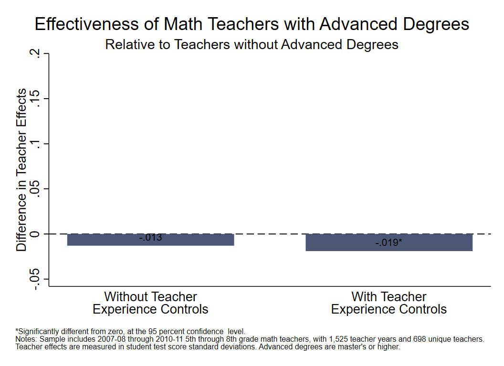

<div class="navbar navbar-default navbar-fixed-top" id="logo">
<div class="container">

</div>
</div>

[OpenSDP Analysis](http://opensdp.github.io/analysis) / [Human Capital Analysis: Development](Human_Capital_Analysis_Development.html) / Examine Teacher Effects by Advanced Degree



###Preparation
####Purpose

Determine whether there are differences in effectiveness estimates for teachers with and without advanced degrees.

####Required analysis file variables

 - `sid`
 - `school_year`
 - `tid_math`
 - `cid_math`
 - `grade_level`
 - `t_is_teacher`
 - `t_adv_degree`
 - `t_experience`
 - `std_scaled_score_math`
 - `std_scaled_score_math_tm1`
 - `std_scaled_score_ela_tm1`

####Analysis-specific sample restrictions

 - Keep only grades and years for which prior-year test scores are available.
 - Keep only students with a single identified current-year core course and current and prior-year test scores in the given subject.

####Ask yourself

 - How are teachers compensated for education beyond a bachelor's degree in your agency? Does your agency subsidize master's degrees as well as reward teachers who have them with higher salaries? What are some ways in which your agency can strengthen the link between compensation and actual performance? 
 - What alternatives can your agency offer to the master's degree bonus? How can your agency customize professional development for the individual teachers' areas for improvement, and reward teachers for progress toward their professional goals and student outcomes? 

####Potential further analyses

- If degree title is available, separate teachers into groups by type of degree (e.g., administrative, content area that does or does not match subject taught). 

###Analysis

####Step 1: Choose the subject for analysis.
 Note: To change from math to ELA, switch the subjects in the next two lines. To generate ELA and math charts at the same time, enclose the analysis code within a loop.


```stata
local subject math
local alt_subject ela
```

####Step 2: Load data. 


```stata
use "${analysis}\Student_Teacher_Year_Analysis.dta", clear  
isid sid school_year
```

####Step 3: Restrict the sample.
Keep grades and years for which prior-year test scores are available. Keep students with teachers with non-missing values for experience and degree information. Keep students with a single identi??? ed core course and current and prior-year test scores in the given subject.


```stata
keep if school_year >= 2008 & school_year <= 2011
keep if grade_level >= 5 & grade_level <= 8
keep if t_is_teacher == 1
keep if !missing(t_adv_degree)
keep if !missing(cid_`subject')
keep if !missing(std_scaled_score_`subject', std_scaled_score_`subject'_tm1)
```

####Step 4: Review teacher variables.


```stata
tab school_year
unique tid_`subject'
unique tid_`subject' school_year
bysort tid_`subject' school_year: gen tag = (_n == 1)
tab t_experience t_adv_degree if tag == 1, mi
drop tag
```

####Step 5: Create teaching experience variables.
Create dummy variables for each year of teaching experience.


```stata
tab t_experience, gen(exp)
```

####Step 6: Generate effects variable.
Create variable for grade-by-year fixed effects.


```stata
egen grade_by_year = group(grade_level school_year)
```

####Step 7: Create previous year score variables.
Create variables for previous year's score squared and cubed.


```stata
gen std_scaled_score_`subject'_tm1_sq = std_scaled_score_`subject'_tm1^2
gen std_scaled_score_`subject'_tm1_cu = std_scaled_score_`subject'_tm1^3
```

####Step 8: Adjust data for missing students.
Create indicator for whether student is missing prior achievement for alternate subject. Make a replacement variable that imputes score to zero if missing.


```stata
gen miss_std_scaled_score_`alt_subject'_tm1 = ///
	missing(std_scaled_score_`alt_subject'_tm1)
gen _IMPstd_scaled_score_`alt_subject'_tm1 = std_scaled_score_`alt_subject'_tm1
replace _IMPstd_scaled_score_`alt_subject'_tm1 = 0 ///
	if miss_std_scaled_score_`alt_subject'_tm1 == 1
```

####Step 9: Choose achievement control variables.
Identify prior achievement variables to use as controls.


```stata
#delimit ;
local prior_achievement 
	"std_scaled_score_`subject'_tm1 
	std_scaled_score_`subject'_tm1_sq
	std_scaled_score_`subject'_tm1_cu 
	_IMPstd_scaled_score_`alt_subject'_tm1 
	miss_std_scaled_score_`alt_subject'_tm1";
#delimit cr
```

####Step 10: Choose student control variables.
Identify other student variables to use as controls.


```stata
#delimit;
local student_controls 
	"s_male 
	s_black 
	s_asian 
	s_latino 
	s_naam 
	s_mult 
	s_racemiss 
	s_reducedlunch 
	s_freelunch 
	s_lunch_miss
	s_retained
	s_retained_miss
	s_gifted
	s_gifted_miss
	s_iep
	s_iep_miss
	s_ell
	s_ell_miss
	s_absence_high
	s_absence_miss";
#delimit cr
```

####Step 11: Review variables.
Review all variables to be included in the teacher effectiveness model. Class and cohort (grade/ school/year) variables should include means of all student variables, and means, standard deviations, and percent missing for prior-year test scores for both main and alternate subject. Class and cohort size should also be included as controls.


```stata
codebook std_scaled_score_`subject' t_adv_degree exp*
codebook `prior_achievement' 
codebook `student_controls' 
codebook _CL*`subject'* 
codebook _CO*
codebook grade_by_year cid_`subject'
```

####Step 12:  Estimate differences in teacher effectiveness.
Compare teachers with and without advanced degrees, without teacher experience controls.


```stata
reg std_scaled_score_`subject' t_adv_degree ///
	`student_controls' `prior_achievement' _CL*`subject'* _CO* ///
	i.grade_by_year, cluster(cid_`subject')
```

####Step 13: Store coefficients and standard errors.


```stata
gen coef_noexp = _b[t_adv_degree]
gen se_noexp = _se[t_adv_degree]
```

####Step 14: Get teacher sample size for model.


```stata
egen teachers_in_sample_noexp = nvals(tid_`subject') if e(sample)
summ teachers_in_sample_noexp
local teachers_in_sample_noexp = r(mean)
```

####Step 15: Estimate differences in teacher effectiveness.
Compare teachers with and without advanced degrees, with teacher experience controls.


```stata
reg std_scaled_score_`subject' t_adv_degree exp* ///
	`student_controls' `prior_achievement' _CL*`subject'* _CO* ///
	i.grade_by_year, cluster(cid_`subject')
```

####Step 16: Store coefficient and standard error.


```stata
gen coef_wexp = _b[t_adv_degree]
gen se_wexp = _se[t_adv_degree]
```

####Step 17: Get sample sizes.
Get teacher sample size for this model and compare sample size for the two models.


```stata
egen teachers_in_sample_wexp = nvals(tid_`subject') if e(sample)
summ teachers_in_sample_wexp
local teachers_in_sample_wexp = r(mean)
assert `teachers_in_sample_wexp' == `teachers_in_sample_noexp'
```

####Step 18: Store teacher sample size for footnote.


```stata
egen teacher_years = nvals(tid_`subject' school_year) if e(sample)
summ teacher_years
local teacher_years = string(r(mean), "%9.0fc")
egen unique_teachers = nvals(tid_`subject') if e(sample)
summ unique_teachers
local unique_teachers = string(r(mean), "%9.0fc")
```

####Step 19: Collapse dataset for graphing.


```stata
collapse(max) coef* se*
```

####Step 20: Get significance.

```stata
foreach spec in noexp wexp {
	gen sig_`spec' = abs(coef_`spec') - 1.96 * se_`spec' > 0
}
```

####Step 21: Reshape for graphing.

```stata
gen results = 1 
reshape long coef_ se_ sig_, i(results) j(spec) string
rename coef_ coef
rename se_ se
rename sig_ sig
replace spec = "1" if spec == "noexp"
replace spec = "2" if spec == "wexp"
destring spec, replace
```

####Step 22: Make value labels with significance indicator.

```stata
tostring sig, replace
replace sig = "*" if sig == "1"
replace sig = ""  if sig == "0"
replace coef = round(coef,.001)
egen coef_label = concat(coef sig)
```

####Step 23: Define subject titles for graph.

```stata
if "`subject'" == "math" {
	local subject_foot "math"
	local subj_title "Math"
}
if "`subject'" == "ela" {
	local subject_foot "English/Language Arts"
	local subj_title "ELA"
}
```

####Step 24: Create a bar graph of the estimation results.

```stata
#delimit ;
graph twoway (bar coef spec,
		fcolor(dknavy) lcolor(dknavy) lwidth(0) barwidth(0.7))
	(scatter coef spec,
		mcolor(none) mlabel(coef_label) mlabcolor(black) mlabpos(12)  
		mlabsize(small)),
	yline(0, style(extended) lpattern(dash) lwidth(medthin) lcolor(black))
	title("Effectiveness of `subj_title' Teachers with Advanced Degrees", 
	span) 
	subtitle("Relative to Teachers without Advanced Degrees", span) 
	ytitle("Difference in Teacher Effects", size(medsmall)) 
	yscale(range(-.05 .2)) 
	ytick(-.05(.05).2) 
	ylabel(-.05(.05).2, nogrid) 
	xlabel("", notick)
	xtitle("") 
	xlabel(1 `""Without Teacher" "Experience Controls""' 
		2 `""With Teacher" "Experience Controls""', labsize(medsmall)) 
	legend(off) 
	graphregion(color(white) fcolor(white) lcolor(white))
	plotregion(color(white) fcolor(white) lcolor(white) margin(5 5 2 0))
	note(" " "*Significantly different from zero, at the 95 percent confidence 
level." "Notes: Sample includes 2007-08 through 2010-11 5th through 8th grade `subj_foot'
teachers, with `teacher_years' teacher years and `unique_teachers' unique teachers." 
"Teacher effects are measured in student test score standard deviations. Advanced degrees
are master's or higher.", size(vsmall) span);	
#delimit cr
```

####Step 25: Save chart.

```stata
graph export "${graphs}/Teacher_Effects_Advanced_Degree_`subj_title'.emf", replace 
graph save "${graphs}/Teacher_Effects_Advanced_Degree_`subj_title'.gph", replace 
```


---

Previous Analysis: [Observe Growth in Teacher Effects for Early Career Teachers](Growth_in_Teacher_Effects.html)
