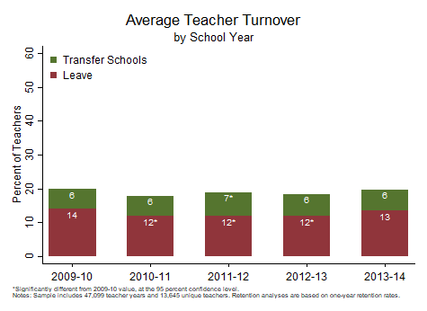

<div class="navbar navbar-default navbar-fixed-top" id="logo">
<div class="container">

</div>
</div>

[OpenSDP Analysis](http://opensdp.github.io/analysis) / [Human Capital Analysis: Retention](Human_Capital_Analysis_Retention.html) / Examine Teacher Turnover Across School Years



###Preparation
####Purpose

Describe the share of teachers who transfer and leave over time.

####Required analysis file variables

 - `tid`
 - `school_year`
 - `t_stay`
 - `t_transfer`
 - `t_leave`


####Analysis-specific sample restrictions

 - Keep only years for which next-year retention status can be calculated.


####Ask yourself

 - How has turnover changed over time?
 - What factors might account for the trends that I see?


####Potential further analyses

Instead of examining turnover by school year, you can use a graph of this type to look at turnover by other categories, including by district, school type, or school. You can also add a loop to the graphing code to generate multiple charts that examine trends over time for a different geographic or other categories.

###Analysis

####Step 1: Load data.


```stata
use "${analysis}\Teacher_Year_Analysis.dta", clear
isid tid school_year
```


####Step 2: Restrict the analysis sample.

Keep only teachers in years for which next-year retention status can be calculated.


```stata
keep if school_year >= 2010 & school_year <= 2014 
assert !missing(t_stay, t_transfer, t_leave)
```


####Step 3: Review variables.


```stata
assert t_leave + t_transfer + t_stay == 1
tab school_year t_stay, mi row
tab school_year t_transfer, mi row
tab school_year t_leave, mi row
```


####Step 4: Get sample size.


```stata
summ tid
local teacher_years = string(r(N), "%9.0fc")
preserve
	bysort tid: keep if _n == 1
	summ tid
	local unique_teachers = string(r(N), "%9.0fc")
restore
```


####Step 5: Calculate significance indicator variables by year.


```stata
foreach var in t_leave t_transfer {
	gen sig_`var' = .
	xi: logit `var' i.school_year, robust
	forval year = 2011/2014 {
		replace sig_`var' = abs(_b[_Ischool_ye_`year'] / _se[_Ischool_ye_`year']) ///
			if school_year == `year'
		replace sig_`var' = 0 if sig_`var' <= 1.96 & school_year == `year'
		replace sig_`var' = 1 if sig_`var' > 1.96 & school_year == `year'
	}
	replace sig_`var' = 0 if school_year == 2010
}
```


####Step 6: Collapse and calculate shares.


```stata
collapse (mean) t_leave t_transfer sig_* (count) tid, by(school_year)
foreach var of varlist t_leave t_transfer {
	replace `var' = `var' * 100
}
```


####Step 7: Concatenate value and significance asterisk.


```stata
foreach var of varlist t_leave t_transfer {
	tostring(sig_`var'), replace
	replace sig_`var' = "*" if sig_`var' == "1"
	replace sig_`var' = "" if sig_`var' == "0"
	gen `var'_str = string(`var', "%9.0f")
	egen `var'_label = concat(`var'_str sig_`var')
}
```


####Step 8: Generate count variable and add variables cumulatively for graphing.


```stata
gen count = _n
replace t_transfer = t_leave + t_transfer
```


####Step 9: Make chart.


```stata
#delimit ;

twoway bar t_transfer count,
	barwidth(.6) color(forest_green) finten(100) ||
	
	bar t_leave count,
	barwidth(.6) color(maroon) finten(100) ||
	
	scatter t_transfer count,
		mlabel(t_transfer_label) 
		msymbol(i) msize(tiny) mlabpos(6) mlabcolor(white) 
		mlabgap(.001) ||

	scatter t_leave count,
		mlabel(t_leave_label) 
		msymbol(i) msize(tiny) mlabpos(6) mlabcolor(white) 
		mlabgap(.001) ||,
		
	title("Average Teacher Turnover", span)
	subtitle("by School Year", span)  
	ytitle("Percent of Teachers", size(medsmall)) 
	yscale(range(0(10)60)) 
	ylabel(0(10)60, nogrid labsize(medsmall)) 
	xtitle("")
	xlabel(1 "2009-10" 2 "2010-11" 3 "2011-12" 4 "2012-13" 5 "2013-14", labsize(medsmall))
	legend(order(1 "Transfer Schools" 2 "Leave")
		ring(0) position(11) symxsize(2) symysize(2) rows(2) size(medsmall) 
		region(lstyle(none) lcolor(none) color(none))) 
	
	graphregion(color(white) fcolor(white) lcolor(white)) plotregion(color(white) 
		fcolor(white) lcolor(white))
	
	note("*Significantly different from 2009-10 value, at the 95 percent confidence
level." "Notes: Sample includes `teacher_years' teacher years and
`unique_teachers' unique teachers. Retention analyses are based on one-year retention
rates.", span size(vsmall)); 

#delimit cr
```


####Step 10: Save chart.


```stata
graph save "$graphs\Retention_by_School_Year.gph", replace 
graph export "$graphs\Retention_by_School_Year.emf", replace
```


---

Previous Analysis: [Calculate Average Annual Teacher Retention](Average_Annual_Teacher_Retention.html)

Next Analysis: [Compare Teacher Turnover Rates Across School Poverty Quartiles](Teacher_Turnover_by_School_Poverty_Quartile.html)
